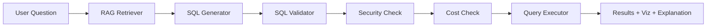

# EngtoSqlDB — AI-Powered Natural Language to SQL Analytics Platform

A production-oriented AI analytics platform that converts natural language into secure SQL queries using schema-aware RAG and an agentic SQL generation workflow, with query validation, cost-based execution controls, automatic error correction, RBAC, observability, and evaluation benchmarks.

## Architecture

```
User Question → Intent Detection → RAG Context Retrieval → SQL Generation → Validation → Security Check → Cost Check → Execution → Results + Visualization + Explanation
```



## Key Features

- **Schema-Aware RAG**: Retrieves relevant tables, columns, business glossary, metrics, and example queries via vector similarity search
- **Agentic SQL Generation**: Context-aware SQL generation with retry and self-correction
- **Multi-Layer Validation**: Syntax → Semantic → Security → Cost validation pipeline
- **RBAC**: Table-level, column-level, and row-level access control
- **Self-Correction**: Automatic error detection and SQL correction (up to 3 retries)
- **Visualization Engine**: Rule-based chart recommendation with LLM fallback
- **AI Explanation**: Natural-language result summarization grounded in actual data
- **Data Pipeline**: Raw → Staging → Analytics with quality checks
- **Observability**: Structured logging, metrics, distributed tracing
- **Evaluation Framework**: 100-question benchmark with accuracy tracking

## Tech Stack

| Layer | Technology |
|-------|-----------|
| Backend | Python 3.11+, FastAPI, Pydantic |
| Database | PostgreSQL (configurable) |
| ORM | SQLAlchemy 2.0 (async) |
| SQL Parsing | sqlglot |
| LLM | OpenAI GPT-4o (configurable, mock available) |
| Embeddings | OpenAI text-embedding-3-small (configurable, mock available) |
| Vector Store | ChromaDB (local, configurable) |
| Frontend | React + TypeScript + Vite |
| Charting | Recharts |
| Testing | pytest + pytest-asyncio |
| Logging | structlog (JSON in production) |
| Migrations | Alembic |
| Linting | Ruff + mypy |
| CI/CD | GitHub Actions |
| Containers | Docker + Docker Compose |

## Project Structure

```
EngtoSqlDB/
├── backend/
│   ├── app/
│   │   ├── agents/              # AI agents (SQL generator, intent, correction)
│   │   ├── api/                 # FastAPI routes and middleware
│   │   ├── core/                # Config, types, exceptions, logging
│   │   ├── infrastructure/      # External service adapters (LLM, embedding, DB, vector store)
│   │   ├── models/              # SQLAlchemy ORM models
│   │   ├── prompts/             # LLM prompt templates (intent, SQL gen, correction, explanation, viz)
│   │   ├── rag/                 # RAG pipeline (indexer, retriever)
│   │   ├── sql/                 # SQL validation, cost analysis, execution
│   │   ├── security/            # RBAC, permission checking, audit
│   │   ├── services/            # Business logic orchestration
│   │   └── main.py              # FastAPI application entry point
│   └── alembic/                 # Database migrations
├── data_pipeline/
│   ├── generators/              # Sample data generation (customers, orders, products)
│   ├── transformations/         # Raw → Staging → Analytics transforms
│   ├── quality/                 # Data quality checks
│   ├── schema_catalog/          # Schema metadata + YAML definitions
│   └── seeds/                   # Database seeding scripts
├── evaluation/                  # Benchmark questions + evaluation scripts
├── tests/
│   ├── unit/                    # Unit tests
│   ├── integration/             # Integration tests
│   └── e2e/                     # End-to-end tests
├── docs/architecture/           # Architecture design documents (10 phases)
├── data/                        # Generated data (CSVs, analytics)
├── docker/                      # Docker Compose files
├── .github/workflows/           # CI/CD pipelines
└── frontend/                    # React UI
```

## Quick Start

### Prerequisites

- Python 3.11+
- PostgreSQL (or use Docker)
- Node.js 18+ (for frontend)

### Setup

```bash
# Clone the repo
git clone <repo-url> && cd EngtoSqlDB

# Create virtual environment and install dependencies
python3 -m venv .venv
source .venv/bin/activate
pip install -e ".[dev,data]"

# Copy environment template
cp .env.example .env

# Generate sample data (no database needed)
python -m data_pipeline.seeds.seed_database --csv-only

# Run the data pipeline (transforms + quality checks)
python -m data_pipeline.pipeline

# Index schema into vector store (for RAG)
python -c "import asyncio; from backend.app.rag.indexer import index_schema_catalog; asyncio.run(index_schema_catalog())"

# Run the backend server
uvicorn backend.app.main:app --reload --port 8000

# Run tests
pytest tests/ -v
```

### With Docker (full stack)

```bash
docker compose -f docker/docker-compose.yml up --build
```

## Development Commands

```bash
make dev          # Install dev dependencies
make test         # Run all tests
make test-unit    # Run unit tests only
make lint         # Run linter
make format       # Format code
make run          # Start dev server
make seed         # Seed database
make docker-up    # Start Docker stack
make evaluate     # Run evaluation benchmark
```

## Environment Variables

See [.env.example](.env.example) for all configuration options. Key variables:

| Variable | Purpose | Required |
|----------|---------|:--------:|
| `DATABASE_URL` | Application database | For DB features |
| `ANALYTICS_DATABASE_URL` | Target query database | For execution |
| `LLM_API_KEY` | OpenAI API key | No (mock available) |
| `EMBEDDING_API_KEY` | OpenAI embedding key | No (mock available) |
| `JWT_SECRET_KEY` | Auth signing key | For auth features |

The system runs fully locally without any API keys using mock providers.

## API Endpoints

| Method | Endpoint | Description |
|--------|----------|-------------|
| POST | `/api/v1/query` | Submit natural language query (full pipeline) |
| POST | `/api/v1/query/validate` | Validate only (no execution) |
| GET | `/api/v1/query/{id}` | Get query record by ID |
| GET | `/api/v1/query/history` | List query history |
| GET | `/api/v1/schema` | Browse available schema |
| GET | `/api/v1/health` | Health check |
| POST | `/api/v1/auth/login` | User login |

## Implementation Progress

| Phase | Component | Status |
|-------|-----------|:------:|
| 0 | Project Foundation | ✅ |
| 1 | Database Layer | ✅ |
| 2 | Sample Data (30K records) | ✅ |
| 3 | Data Pipeline (raw→staging→analytics) | ✅ |
| 4 | Schema Intelligence (YAML catalog) | ✅ |
| 5 | RAG System (embed + vector search) | ✅ |
| 6 | LLM Provider (OpenAI + mock) | ✅ |
| 7 | SQL Generation Agent | ✅ |
| 8 | SQL Validation | 🔄 Next |
| 9 | RBAC & Permissions | ⬜ |
| 10 | Query Cost Protection | ⬜ |
| 11 | Agentic Workflow (Orchestrator) | ⬜ |
| 12 | FastAPI Backend (all endpoints) | ⬜ |
| 13 | Query History | ⬜ |
| 14 | Result Processing | ⬜ |
| 15 | Visualization Engine | ⬜ |
| 16 | AI Explanation | ⬜ |
| 17 | Frontend (React) | ⬜ |
| 18 | Observability | ⬜ |
| 19 | Evaluation Framework | ⬜ |
| 20 | Testing (full suite) | ⬜ |
| 21 | Docker | ⬜ |
| 22 | CI/CD | ⬜ |
| 23 | Documentation | ⬜ |

## Architecture Documentation

Detailed design documents are available in `docs/architecture/`:

- [Phase 1 — System Architecture](docs/architecture/PHASE_1_ARCHITECTURE.md)
- [Phase 2 — Project Structure](docs/architecture/PHASE_2_PROJECT_STRUCTURE.md)
- [Phase 3 — Technology Matrix](docs/architecture/PHASE_3_TECHNOLOGY_MATRIX.md)
- [Phase 4 — Database Design](docs/architecture/PHASE_4_DATABASE_DESIGN.md)
- [Phase 5 — API Design](docs/architecture/PHASE_5_API_DESIGN.md)
- [Phase 6 — Agent Design](docs/architecture/PHASE_6_AGENT_DESIGN.md)
- [Phase 7 — Security Design](docs/architecture/PHASE_7_SECURITY_DESIGN.md)
- [Phase 8 — Evaluation Framework](docs/architecture/PHASE_8_EVALUATION.md)
- [Phase 9 — Team Tasks](docs/architecture/PHASE_9_TEAM_TASKS.md)
- [Phase 10 — Implementation Plan](docs/architecture/PHASE_10_IMPLEMENTATION_PLAN.md)

## Design Principles

1. **Clean Architecture**: Business logic is independent of infrastructure (all external services behind interfaces)
2. **Provider Agnostic**: LLM, embedding, vector store, database are all swappable via adapters
3. **Defense in Depth**: SQL goes through syntax → semantic → security → cost validation before execution
4. **Offline-First Development**: Everything works locally with mock providers (no API keys needed)
5. **Observable**: Structured logging with request_id tracing across all components
6. **Testable**: Each module is independently testable with mock dependencies

## License

MIT
