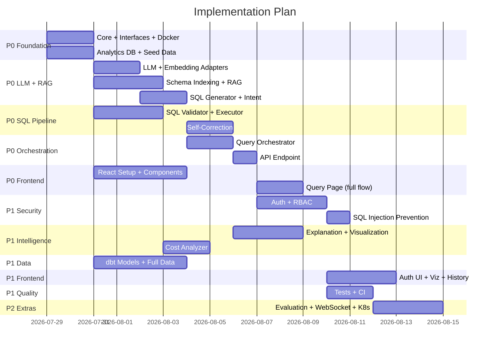

# Phase 10 — Implementation Plan

## Priority Definitions

| Priority | Definition | Criteria |
|----------|-----------|----------|
| **P0 — Must Have** | System is non-functional without this | Core pipeline works end-to-end |
| **P1 — Important** | System works but is incomplete/insecure without this | Security, observability, quality |
| **P2 — Nice to Have** | Enhances quality, UX, or portfolio signal | Polish, advanced features |

---

## 10.1 P0 — Must Have (System Functional)

> **Goal**: A user can submit a natural language question and receive SQL + results back.

### P0.1 Foundation (Day 1-2)

| # | Task | Owner | Description |
|---|------|-------|-------------|
| P0.1.1 | Core module (`core/config.py`, `types.py`, `exceptions.py`) | Dev C | Pydantic settings, shared types, exception hierarchy |
| P0.1.2 | Protocol interfaces (all 6: LLM, Embedding, VectorStore, DB, Auth, Observability) | Dev C + A | Abstract base classes defining contracts |
| P0.1.3 | Docker Compose (PostgreSQL + vector store + backend) | Dev D | Local dev environment |
| P0.1.4 | Analytics database schema + seed data (at least 3 tables) | Dev B | Working database to query against |
| P0.1.5 | pyproject.toml + dependency management | Dev C | Project metadata, deps organized |
| P0.1.6 | FastAPI app skeleton (main.py, health endpoint) | Dev C | Server starts, /health returns 200 |

### P0.2 LLM + RAG Pipeline (Day 2-4)

| # | Task | Owner | Description |
|---|------|-------|-------------|
| P0.2.1 | LLM Provider adapter (for `<LLM_PROVIDER>`) | Dev A | Working generate() and generate_structured() |
| P0.2.2 | Embedding Provider adapter | Dev A | Working embed() method |
| P0.2.3 | Vector Store adapter | Dev A | Working search() and upsert() |
| P0.2.4 | Schema metadata YAML definitions | Dev B | Tables, columns, descriptions, relationships |
| P0.2.5 | Schema indexing script (YAML → vector store) | Dev B | Populate vector store with schema embeddings |
| P0.2.6 | RAG Retriever (embed question → search → return context) | Dev A | Working retrieve_context() |
| P0.2.7 | SQL Generation prompt + agent | Dev A | Generate SQL from question + context |
| P0.2.8 | Intent Detection prompt + agent | Dev A | Classify question intent |

### P0.3 SQL Pipeline (Day 3-5)

| # | Task | Owner | Description |
|---|------|-------|-------------|
| P0.3.1 | SQL Validator (basic: parse + SELECT-only check) | Dev C | Blocks non-SELECT, validates syntax |
| P0.3.2 | Query Executor (read-only connection, timeout, max_rows) | Dev C | Execute SQL safely, return results |
| P0.3.3 | Database adapter (SQLAlchemy async, connection pool) | Dev C | Working DB sessions for both app + analytics DB |
| P0.3.4 | Result Processor (type coercion, NULL handling) | Dev C | Clean results for API response |
| P0.3.5 | Self-Correction agent (basic: 1 retry with error context) | Dev A | Fix common SQL errors |

### P0.4 Orchestration (Day 4-6)

| # | Task | Owner | Description |
|---|------|-------|-------------|
| P0.4.1 | Query Orchestrator (state machine, happy path) | Dev C | Full pipeline: intent → RAG → generate → validate → execute → result |
| P0.4.2 | Query Orchestrator (error path: self-correction loop) | Dev C | Route validation/execution failures to correction agent |
| P0.4.3 | POST /api/v1/query endpoint (full pipeline) | Dev C | Wire API → orchestrator → response |
| P0.4.4 | Pydantic request/response schemas | Dev C | QueryRequest, QueryResponse models |

### P0.5 Minimum Frontend (Day 5-7)

| # | Task | Owner | Description |
|---|------|-------|-------------|
| P0.5.1 | React project setup (Vite + TypeScript + routing) | Dev D | Scaffold, build works |
| P0.5.2 | Query Input component (text box + submit) | Dev D | User can type and submit |
| P0.5.3 | Results Table component | Dev D | Display tabular results |
| P0.5.4 | SQL Viewer component | Dev D | Show generated SQL |
| P0.5.5 | API client (POST /query call) | Dev D | Frontend talks to backend |
| P0.5.6 | Query Page (wires input → API → results) | Dev D | Full user flow works |

### P0 Definition of Done

✅ User types "Show me top 5 products by revenue" in the UI  
✅ Backend generates correct SQL via LLM + RAG  
✅ SQL is validated (SELECT-only)  
✅ SQL executes against seeded analytics database  
✅ Results display in the frontend table  
✅ If SQL has an error, self-correction tries to fix it (at least 1 retry)  
✅ System runs via `docker-compose up`  

---

## 10.2 P1 — Important (Security, Quality, Completeness)

> **Goal**: System is secure, observable, and handles edge cases properly.

### P1.1 Security (Day 5-7)

| # | Task | Owner | Description |
|---|------|-------|-------------|
| P1.1.1 | JWT authentication (login + token validation middleware) | Dev C | Working auth flow |
| P1.1.2 | RBAC permission engine (table + column level) | Dev C | Check permissions before execution |
| P1.1.3 | Security checker integration into orchestrator | Dev C | Denied queries are blocked |
| P1.1.4 | SQL injection prevention (pattern detection) | Dev C | Catch suspicious SQL patterns |
| P1.1.5 | API key support (alternative auth for programmatic access) | Dev C | Create/validate API keys |
| P1.1.6 | Rate limiting middleware | Dev C | Per-user rate limits |
| P1.1.7 | Audit logging | Dev C | Security events logged |

### P1.2 Enhanced Intelligence (Day 5-7)

| # | Task | Owner | Description |
|---|------|-------|-------------|
| P1.2.1 | Explanation Generator agent | Dev A | Natural-language result summary |
| P1.2.2 | Visualization Recommender (rule-based) | Dev A | Determine chart type from result shape |
| P1.2.3 | RAG: Re-ranker + deduplication | Dev A | Improve retrieval relevance |
| P1.2.4 | Business glossary integration into RAG | Dev B + A | Include business definitions in context |
| P1.2.5 | Example queries in RAG | Dev B | Similar past queries for few-shot |
| P1.2.6 | Cost Analyzer (EXPLAIN integration) | Dev C | Warn on expensive queries |

### P1.3 Data Pipeline (Day 5-7)

| # | Task | Owner | Description |
|---|------|-------|-------------|
| P1.3.1 | Full sample data (1K customers, 10K orders, 30K items) | Dev B | Realistic data volumes |
| P1.3.2 | dbt staging models | Dev B | Clean data transformations |
| P1.3.3 | dbt mart models (fct_revenue, dim_products) | Dev B | Analytics-ready tables |
| P1.3.4 | Data quality checks | Dev B | Validate data integrity |
| P1.3.5 | Metric definitions (YAML) | Dev B | Revenue, AOV, customer count formulas |

### P1.4 Frontend Enhancements (Day 6-8)

| # | Task | Owner | Description |
|---|------|-------|-------------|
| P1.4.1 | Login page + auth flow | Dev D | JWT-based login in frontend |
| P1.4.2 | Visualization component (Recharts: bar, line, pie, KPI) | Dev D | Render charts from viz config |
| P1.4.3 | Explanation Card component | Dev D | Display AI explanation |
| P1.4.4 | Query History page | Dev D | Browse past queries |
| P1.4.5 | Loading states + error handling | Dev D | UX polish |
| P1.4.6 | Schema Explorer page | Dev D | Browse available tables/columns |

### P1.5 Observability + Testing (Day 7-8)

| # | Task | Owner | Description |
|---|------|-------|-------------|
| P1.5.1 | Structured logging (all agents log with request_id) | Dev C | Traceable logs |
| P1.5.2 | Metrics emission (latency, tokens, success rate) | Dev C | Key metrics tracked |
| P1.5.3 | Unit tests for SQL validator | Dev C | >90% coverage on validator |
| P1.5.4 | Unit tests for agents (mocked LLM) | Dev A | Test prompt assembly, response parsing |
| P1.5.5 | Integration test: full query flow | Dev C + A | End-to-end with real DB, mocked LLM |
| P1.5.6 | CI pipeline (lint + test + build) | Dev D | GitHub Actions on every PR |

### P1 Definition of Done

✅ Users must log in (JWT auth works)  
✅ RBAC blocks unauthorized table/column access  
✅ SQL injection patterns are detected and blocked  
✅ Query results include visualization + explanation  
✅ History page shows past queries  
✅ Structured logs capture every request with latency  
✅ CI pipeline runs tests on every push  
✅ dbt models transform raw data into clean analytics tables  

---

## 10.3 P2 — Nice to Have (Polish, Advanced Features)

> **Goal**: Portfolio-impressive, interview-discussion-worthy features.

### P2.1 Advanced Features

| # | Task | Owner | Description |
|---|------|-------|-------------|
| P2.1.1 | WebSocket streaming (real-time state updates during query) | Dev C + D | Show "Analyzing intent...", "Generating SQL...", etc. |
| P2.1.2 | Query suggestions (auto-complete based on schema) | Dev A + D | Suggest questions from schema context |
| P2.1.3 | Multi-dialect support (PostgreSQL + MySQL) | Dev C | Dialect-specific validation + generation |
| P2.1.4 | Query comparison (side-by-side for correction history) | Dev D | Show original vs. corrected SQL |
| P2.1.5 | Export results (CSV, JSON, clipboard) | Dev D | Download data |
| P2.1.6 | Dark mode | Dev D | UI theming |

### P2.2 Evaluation & Benchmarking

| # | Task | Owner | Description |
|---|------|-------|-------------|
| P2.2.1 | Full benchmark dataset (100 questions) | Dev B | Comprehensive evaluation coverage |
| P2.2.2 | Evaluation runner + report generation | Dev A + B | Automated accuracy measurement |
| P2.2.3 | Scheduled evaluation in CI (weekly) | Dev D | Track accuracy over time |
| P2.2.4 | Evaluation dashboard (display metrics in admin) | Dev D | Visual reporting |

### P2.3 Data Engineering Extras

| # | Task | Owner | Description |
|---|------|-------|-------------|
| P2.3.1 | Dagster DAG for full pipeline orchestration | Dev B | Demonstrates data engineering skills |
| P2.3.2 | Data lineage tracking | Dev B | Show data provenance |
| P2.3.3 | Incremental loading (CDC-style) | Dev B | Advanced pipeline patterns |
| P2.3.4 | Data quality dashboard | Dev B + D | Visualize quality check results |

### P2.4 Infrastructure & DevOps

| # | Task | Owner | Description |
|---|------|-------|-------------|
| P2.4.1 | Kubernetes manifests (production deployment) | Dev D | K8s deployment shows DevOps maturity |
| P2.4.2 | Terraform modules (infrastructure-as-code) | Dev D | Cloud deployment readiness |
| P2.4.3 | Grafana dashboards (pre-built) | Dev D | Observability visualization |
| P2.4.4 | OpenTelemetry tracing integration | Dev C | Distributed trace spans |
| P2.4.5 | Load testing (Locust) | Dev D | Performance under load |
| P2.4.6 | CD pipeline (deploy to staging) | Dev D | Full deployment automation |

### P2.5 Documentation & Polish

| # | Task | Owner | Description |
|---|------|-------|-------------|
| P2.5.1 | Architecture Decision Records (ADRs) | All | Documented reasoning |
| P2.5.2 | API documentation (exported OpenAPI + examples) | Dev C + D | Professional docs |
| P2.5.3 | Demo video / GIF recording | Dev D | Portfolio showcase |
| P2.5.4 | Contributing guide | Dev D | Shows team collaboration awareness |
| P2.5.5 | Performance benchmarks document | Dev C | Latency, throughput numbers |

---

## 10.4 Implementation Timeline Summary

---

## 10.5 Milestone Checkpoints

| Milestone | Date (Relative) | Criteria |
|-----------|:-----------:|----------|
| **M0: Infrastructure Ready** | Day 2 | Docker up, DB seeded, FastAPI /health responds |
| **M1: Happy Path Works** | Day 5 | Question → SQL → Results (no auth, basic validation) |
| **M2: Secure & Complete** | Day 7 | Auth, RBAC, viz, explanation, history all working |
| **M3: Production-Ready** | Day 9 | CI passes, tests >80% coverage, docs written, evaluation run |

---

## 10.6 Risk Mitigations

| Risk | Mitigation |
|------|-----------|
| LLM API costs during development | Use Ollama for local dev; limit calls with caching |
| LLM generates poor SQL | Invest early in prompt engineering (A3); self-correction covers gaps |
| Integration breaks across teams | Day-1 interface agreement; integration tests from Day 4 |
| Docker setup issues | Dev D provides setup script + troubleshooting guide Day 1 |
| Scope creep | Strict P0 focus first — P1/P2 only after M1 milestone met |
| Database performance | Statement timeouts + EXPLAIN analyzer prevent runaway queries |

---

## 10.7 Summary Decision

**Start implementation?** The full architecture is documented across Phases 1-9. After your review and approval, we implement module-by-module starting from P0.1.

Each implementation step will include:
1. What the module does
2. Which files are created/modified
3. Complete production-quality code
4. Tests
5. How to run it
6. How it integrates

---

## 10.8 Implementation Status (Live)

*Last updated: 2026-07-29*

| Phase | Status | Notes |
|-------|:------:|-------|
| P0 Foundation | ✅ | Config, exceptions, types, logging, FastAPI skeleton, 20 tests passing |
| P1 Database | ✅ | Dual-engine (app + analytics), 11 ORM models, Alembic migrations |
| P2 Sample Data | ✅ | ~30K records generated (10 regions, 20 categories, 200 products, 1K customers, 10K orders, 18.7K items) |
| P3 Data Pipeline | ✅ | Raw → Staging → Analytics, 21 quality checks, 3 fact tables |
| P4 Schema Intelligence | ✅ | YAML catalog: 6 tables, 14 glossary terms, 11 metrics, 10 examples |
| P5 RAG System | ✅ | Mock + OpenAI embedding, ChromaDB vector store, 46 docs indexed, context retriever |
| P6 LLM Provider | ✅ | OpenAI + Mock adapter, 5 prompt templates, valid JSON responses |
| P7 SQL Generation | ✅ | Context-aware SQL generator with retry logic, full RAG→LLM pipeline works |
| P8 SQL Validation | 🔄 | Next up |
| P9-P23 | ⬜ | Pending |

---

*End of Architecture & Design Document. Approved and implementation in progress.*
