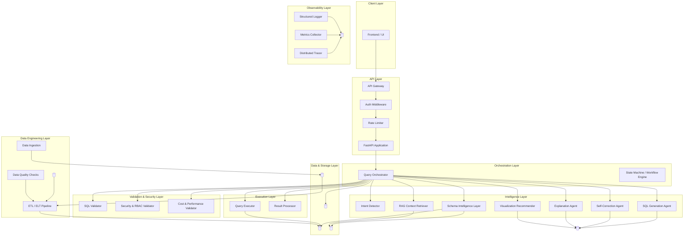
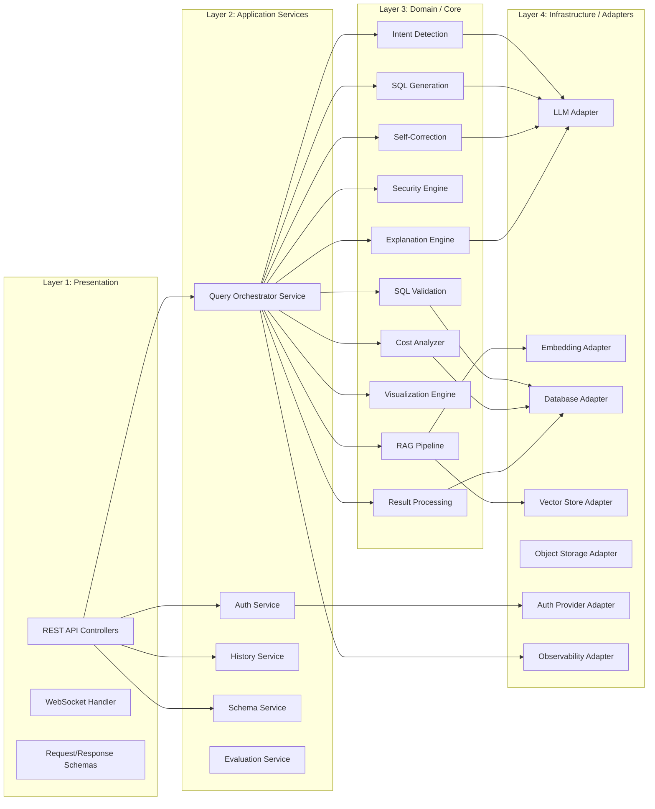
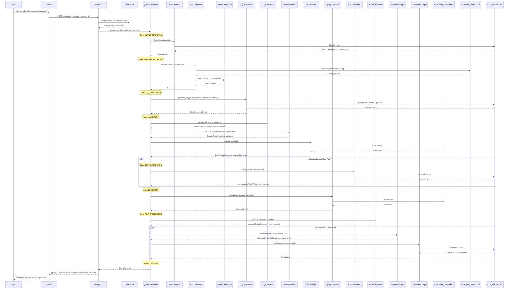
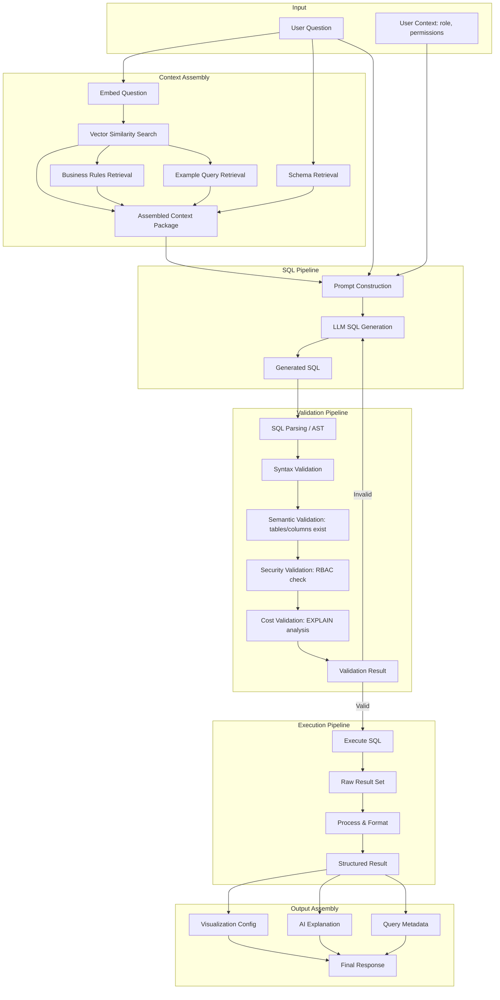
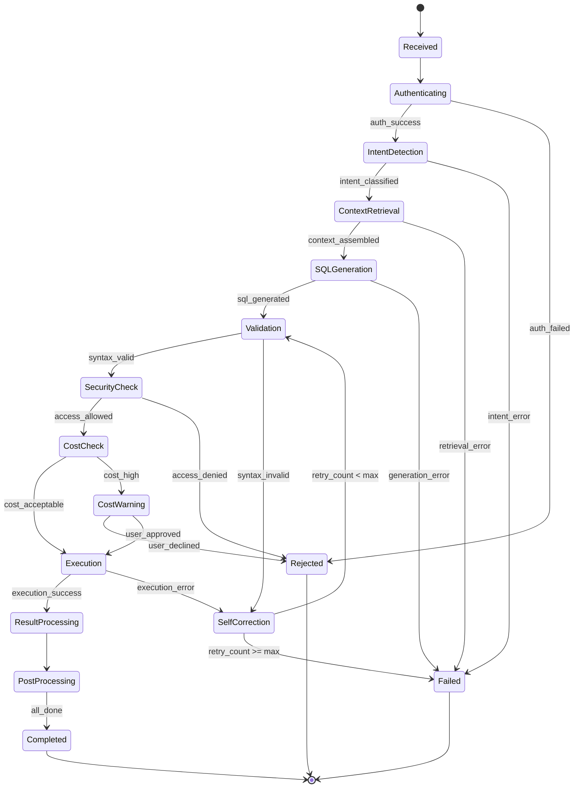
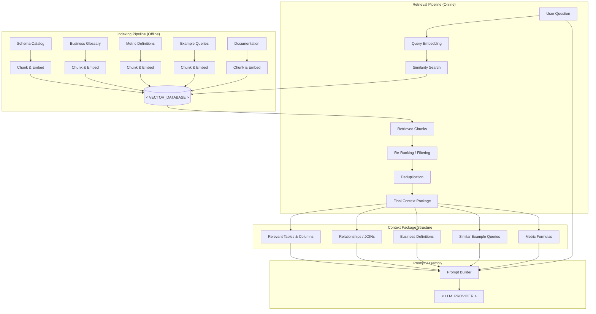
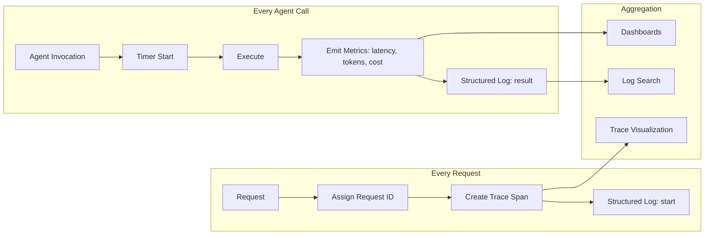

# Phase 1 — Architecture

## 1.1 High-Level System Architecture



---

## 1.2 Component Architecture (Layered View)



---

## 1.3 Component Descriptions

| Component | Responsibility | Key Interfaces |
|-----------|---------------|----------------|
| **API Gateway** | Request routing, CORS, request ID generation, API versioning | `handle_request()` |
| **Auth Middleware** | JWT/token validation, user extraction, session management | `authenticate()`, `get_current_user()` |
| **Rate Limiter** | Per-user and global rate limiting | `check_rate_limit()` |
| **Query Orchestrator** | Central coordinator — drives the entire query lifecycle as a state machine | `process_query()`, `get_state()` |
| **Intent Detector** | Classifies user question into categories (analytics, definition, comparison, aggregation) | `detect_intent()` |
| **Schema Intelligence Layer** | Manages metadata catalog — tables, columns, relationships, business definitions | `get_schema()`, `search_schema()` |
| **RAG Context Retriever** | Retrieves relevant schema, examples, glossary via vector similarity | `retrieve_context()` |
| **SQL Generation Agent** | Produces SQL from natural language + context | `generate_sql()` |
| **SQL Validator** | Parses and validates SQL syntax, checks for dangerous operations | `validate()` |
| **Security & RBAC Validator** | Enforces table/column/row-level access based on user role | `check_permissions()` |
| **Cost & Performance Validator** | Runs EXPLAIN, estimates cost, enforces limits | `estimate_cost()` |
| **Self-Correction Agent** | Receives errors, regenerates SQL with error context | `correct_sql()` |
| **Query Executor** | Executes validated SQL against the target database with timeouts | `execute()` |
| **Result Processor** | Formats raw DB results, handles pagination, NULL handling | `process_results()` |
| **Visualization Recommender** | Determines chart type from result shape and query intent | `recommend_visualization()` |
| **Explanation Agent** | Generates natural-language summary of results | `explain_results()` |
| **Observability** | Structured logging, metrics emission, distributed tracing | `log()`, `emit_metric()`, `trace()` |
| **Data Pipeline** | Ingests raw data, transforms to analytics-ready tables | `run_pipeline()` |

---

## 1.4 End-to-End Request Flow



---

## 1.5 Data Flow Diagram



---

## 1.6 Agent / Workflow Architecture



### Agent Node Descriptions

| Node | Agent Type | LLM Required | Description |
|------|-----------|:---:|-------------|
| Intent Detection | LLM Agent | ✓ | Classifies question type, extracts entities, determines DB dialect needs |
| Context Retrieval | Deterministic + Embedding | ✓ (embedding) | Vector search + schema lookup — assembles full context package |
| SQL Generation | LLM Agent | ✓ | Core generation — takes context and produces SQL |
| Validation | Deterministic | ✗ | SQL parsing, AST analysis, syntax/semantic checks |
| Security Check | Deterministic | ✗ | RBAC table/column/row matching against user permissions |
| Cost Check | Deterministic | ✗ | EXPLAIN plan analysis, threshold comparison |
| Self-Correction | LLM Agent | ✓ | Receives error + original context, produces corrected SQL |
| Result Processing | Deterministic | ✗ | Formatting, pagination, NULL handling |
| Visualization | Hybrid (rules + LLM fallback) | Optional | Rule-based chart selection with LLM fallback for ambiguous cases |
| Explanation | LLM Agent | ✓ | Summarizes results in natural language |

### Workflow Orchestration Design

The Query Orchestrator implements a **finite state machine** pattern:

```python
class QueryState(Enum):
    RECEIVED = "received"
    AUTHENTICATING = "authenticating"
    INTENT_DETECTION = "intent_detection"
    CONTEXT_RETRIEVAL = "context_retrieval"
    SQL_GENERATION = "sql_generation"
    VALIDATION = "validation"
    SECURITY_CHECK = "security_check"
    COST_CHECK = "cost_check"
    EXECUTION = "execution"
    SELF_CORRECTION = "self_correction"
    RESULT_PROCESSING = "result_processing"
    POST_PROCESSING = "post_processing"
    COMPLETED = "completed"
    FAILED = "failed"
    REJECTED = "rejected"
```

The orchestrator is framework-agnostic. It exposes a `process_query()` interface. Internally it can be wired to `<AGENT_FRAMEWORK>` (LangGraph, CrewAI, custom DAG, etc.) without changing the external contract.

---

## 1.7 RAG Workflow (Detailed)



### RAG Indexing Strategy

| Source | Chunk Strategy | Metadata |
|--------|---------------|----------|
| Table schemas | One chunk per table (name + columns + descriptions) | `{source: "schema", table: "...", database: "..."}` |
| Column details | One chunk per column (with parent table context) | `{source: "column", table: "...", column: "..."}` |
| Business glossary | One chunk per term | `{source: "glossary", term: "..."}` |
| Metrics | One chunk per metric (formula + description) | `{source: "metric", metric_name: "..."}` |
| Example queries | One chunk per example (question + SQL + explanation) | `{source: "example", category: "..."}` |
| Relationships | One chunk per FK/relationship | `{source: "relationship", tables: [...]}` |

### Retrieval Configuration

```python
class RAGConfig:
    top_k: int = 10                  # Initial retrieval count
    rerank_top_k: int = 5            # After re-ranking
    similarity_threshold: float = 0.7 # Minimum relevance score
    include_examples: bool = True
    include_glossary: bool = True
    max_context_tokens: int = 4000   # Token budget for context
```

### Context Assembly Rules

1. **Always include**: Tables and columns detected as relevant
2. **Always include**: Foreign key relationships between relevant tables
3. **Include if available**: Business definitions for ambiguous terms
4. **Include if available**: Similar example queries (max 3)
5. **Include if available**: Metric formulas referenced in the question
6. **Never include**: Entire database schema
7. **Budget-aware**: Total context must fit within `max_context_tokens`

---

## 1.8 Cross-Cutting Concerns

### Observability Flow



### Error Propagation

```text
Agent Error
    ↓
Captured by Orchestrator
    ↓
Logged with full context (request_id, state, input, error)
    ↓
Decision:
  - Retryable? → Route to Self-Correction (up to MAX_RETRIES)
  - Non-retryable? → Transition to FAILED state
  - Security violation? → Transition to REJECTED state
    ↓
User receives structured error response with:
  - Error category
  - User-friendly message
  - Suggestion (if applicable)
  - query_id for support reference
```

---

## 1.9 Key Architecture Decisions

| Decision | Choice | Rationale |
|----------|--------|-----------|
| Orchestration pattern | State Machine | Explicit states, easy to debug, resume, and observe |
| RAG strategy | Selective retrieval | Avoids sending entire schema; reduces token cost and hallucination |
| SQL validation | Multi-layer (syntax → semantic → security → cost) | Defense in depth; each layer catches different issues |
| LLM usage | Separate prompts per task | Smaller, focused prompts = higher accuracy + easier testing |
| Self-correction | Bounded retry with error context | Prevents infinite loops; error feedback improves correction |
| Visualization | Rule-based with LLM fallback | Deterministic for common cases; LLM for ambiguous edge cases |
| Architecture style | Clean Architecture (ports & adapters) | Infrastructure-independent; every external service is replaceable |
| Async | Async I/O for all external calls | LLM, DB, vector store are all I/O-bound; async maximizes throughput |

---

## 1.10 Interface Contracts (Key Abstractions)

```python
# All external dependencies are behind interfaces

class LLMProvider(Protocol):
    async def generate(self, prompt: str, **kwargs) -> LLMResponse: ...
    async def generate_structured(self, prompt: str, schema: type) -> Any: ...

class EmbeddingProvider(Protocol):
    async def embed(self, text: str) -> list[float]: ...
    async def embed_batch(self, texts: list[str]) -> list[list[float]]: ...

class VectorStore(Protocol):
    async def search(self, embedding: list[float], top_k: int) -> list[SearchResult]: ...
    async def upsert(self, documents: list[Document]) -> None: ...

class DatabaseExecutor(Protocol):
    async def execute(self, sql: str, params: dict | None = None) -> QueryResult: ...
    async def explain(self, sql: str) -> QueryPlan: ...

class AuthProvider(Protocol):
    async def validate_token(self, token: str) -> UserContext: ...
    async def get_permissions(self, user_id: str) -> Permissions: ...

class ObservabilityProvider(Protocol):
    def log(self, level: str, message: str, **context) -> None: ...
    def emit_metric(self, name: str, value: float, tags: dict) -> None: ...
    def start_span(self, name: str) -> Span: ...
```

These abstractions ensure the entire system can switch providers (e.g., from one `<LLM_PROVIDER>` to another) by implementing a new adapter — zero changes to business logic.
