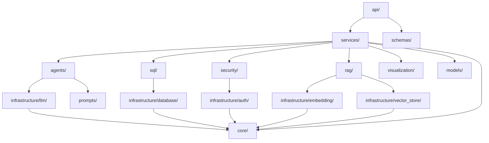

# Phase 2 — Project Structure

## Complete Monorepo Layout

```text
ai-text-to-sql/
│
├── backend/
│   ├── app/
│   │   ├── __init__.py
│   │   ├── main.py                          # FastAPI application entry point
│   │   ├── dependencies.py                  # Dependency injection container
│   │   │
│   │   ├── api/
│   │   │   ├── __init__.py
│   │   │   ├── router.py                    # Root API router
│   │   │   ├── middleware/
│   │   │   │   ├── __init__.py
│   │   │   │   ├── auth.py                  # Authentication middleware
│   │   │   │   ├── rate_limit.py            # Rate limiting middleware
│   │   │   │   ├── request_id.py            # Request ID injection
│   │   │   │   └── logging.py              # Request/response logging
│   │   │   ├── v1/
│   │   │   │   ├── __init__.py
│   │   │   │   ├── router.py               # v1 router aggregator
│   │   │   │   ├── query.py                # POST /query, GET /query/{id}
│   │   │   │   ├── schema.py               # GET /schema endpoints
│   │   │   │   ├── history.py              # GET /history endpoints
│   │   │   │   ├── health.py               # GET /health, /readiness
│   │   │   │   └── admin.py                # Admin endpoints (metrics, config)
│   │   │   └── errors/
│   │   │       ├── __init__.py
│   │   │       ├── handlers.py             # Global exception handlers
│   │   │       └── responses.py            # Standardized error response models
│   │   │
│   │   ├── core/
│   │   │   ├── __init__.py
│   │   │   ├── config.py                   # Settings via pydantic-settings
│   │   │   ├── constants.py                # Application constants
│   │   │   ├── exceptions.py               # Custom exception hierarchy
│   │   │   └── types.py                    # Shared type definitions
│   │   │
│   │   ├── models/
│   │   │   ├── __init__.py
│   │   │   ├── user.py                     # User ORM model
│   │   │   ├── query_record.py             # Query history ORM model
│   │   │   ├── schema_metadata.py          # Schema catalog ORM model
│   │   │   ├── permission.py               # RBAC permission models
│   │   │   └── audit_log.py               # Audit trail ORM model
│   │   │
│   │   ├── schemas/
│   │   │   ├── __init__.py
│   │   │   ├── request/
│   │   │   │   ├── __init__.py
│   │   │   │   ├── query.py               # QueryRequest schema
│   │   │   │   └── admin.py               # Admin request schemas
│   │   │   └── response/
│   │   │       ├── __init__.py
│   │   │       ├── query.py               # QueryResponse schema
│   │   │       ├── schema.py              # SchemaResponse
│   │   │       ├── history.py             # HistoryResponse
│   │   │       └── health.py             # HealthResponse
│   │   │
│   │   ├── services/
│   │   │   ├── __init__.py
│   │   │   ├── query_orchestrator.py       # Central orchestrator (state machine)
│   │   │   ├── auth_service.py             # Authentication business logic
│   │   │   ├── history_service.py          # Query history CRUD
│   │   │   ├── schema_service.py           # Schema catalog management
│   │   │   └── evaluation_service.py       # Benchmark evaluation runner
│   │   │
│   │   ├── agents/
│   │   │   ├── __init__.py
│   │   │   ├── base.py                     # BaseAgent abstract class
│   │   │   ├── intent_detector.py          # Intent classification agent
│   │   │   ├── sql_generator.py            # SQL generation agent
│   │   │   ├── self_correction.py          # Error correction agent
│   │   │   ├── explanation.py              # Result explanation agent
│   │   │   └── visualization.py           # Visualization recommendation agent
│   │   │
│   │   ├── rag/
│   │   │   ├── __init__.py
│   │   │   ├── retriever.py               # Context retriever (main interface)
│   │   │   ├── indexer.py                 # Document indexing pipeline
│   │   │   ├── chunker.py                # Chunking strategies
│   │   │   ├── ranker.py                 # Re-ranking logic
│   │   │   └── context_builder.py        # Assembles final context package
│   │   │
│   │   ├── sql/
│   │   │   ├── __init__.py
│   │   │   ├── validator.py              # SQL validation engine
│   │   │   ├── parser.py                 # SQL AST parsing
│   │   │   ├── cost_analyzer.py          # EXPLAIN-based cost estimation
│   │   │   ├── executor.py              # Query execution with timeouts
│   │   │   └── dialect.py               # Dialect-specific helpers
│   │   │
│   │   ├── security/
│   │   │   ├── __init__.py
│   │   │   ├── rbac.py                   # Role-based access control engine
│   │   │   ├── permission_checker.py     # Table/column/row permission checks
│   │   │   ├── sql_sanitizer.py          # SQL injection prevention
│   │   │   └── audit.py                 # Security audit logging
│   │   │
│   │   ├── visualization/
│   │   │   ├── __init__.py
│   │   │   ├── recommender.py           # Chart type recommendation
│   │   │   ├── rules.py                 # Deterministic rules engine
│   │   │   └── config_builder.py        # Builds chart configuration
│   │   │
│   │   ├── infrastructure/
│   │   │   ├── __init__.py
│   │   │   ├── llm/
│   │   │   │   ├── __init__.py
│   │   │   │   ├── base.py             # LLMProvider protocol
│   │   │   │   └── adapter.py          # Concrete adapter for <LLM_PROVIDER>
│   │   │   ├── embedding/
│   │   │   │   ├── __init__.py
│   │   │   │   ├── base.py             # EmbeddingProvider protocol
│   │   │   │   └── adapter.py          # Concrete adapter for <EMBEDDING_PROVIDER>
│   │   │   ├── vector_store/
│   │   │   │   ├── __init__.py
│   │   │   │   ├── base.py             # VectorStore protocol
│   │   │   │   └── adapter.py          # Concrete adapter for <VECTOR_DATABASE>
│   │   │   ├── database/
│   │   │   │   ├── __init__.py
│   │   │   │   ├── base.py             # DatabaseExecutor protocol
│   │   │   │   ├── session.py          # DB session management
│   │   │   │   └── adapter.py          # Concrete adapter for <PRIMARY_DATABASE>
│   │   │   ├── auth/
│   │   │   │   ├── __init__.py
│   │   │   │   ├── base.py             # AuthProvider protocol
│   │   │   │   └── adapter.py          # Concrete adapter for <AUTH_PROVIDER>
│   │   │   ├── storage/
│   │   │   │   ├── __init__.py
│   │   │   │   ├── base.py             # ObjectStorage protocol
│   │   │   │   └── adapter.py          # Concrete adapter for <OBJECT_STORAGE>
│   │   │   └── observability/
│   │   │       ├── __init__.py
│   │   │       ├── base.py             # ObservabilityProvider protocol
│   │   │       ├── logger.py           # Structured logging setup
│   │   │       ├── metrics.py          # Metrics emission
│   │   │       └── tracing.py          # Distributed tracing
│   │   │
│   │   └── prompts/
│   │       ├── __init__.py
│   │       ├── intent_detection.py      # Intent classification prompts
│   │       ├── sql_generation.py        # SQL generation prompts
│   │       ├── sql_correction.py        # Self-correction prompts
│   │       ├── explanation.py           # Result explanation prompts
│   │       └── visualization.py        # Visualization recommendation prompts
│   │
│   ├── alembic/
│   │   ├── env.py
│   │   ├── versions/                    # Migration files
│   │   └── alembic.ini
│   │
│   ├── requirements/
│   │   ├── base.txt                    # Core dependencies
│   │   ├── dev.txt                     # Development tools
│   │   ├── test.txt                    # Test dependencies
│   │   └── prod.txt                    # Production extras
│   │
│   ├── pyproject.toml                  # Project metadata, tool configs
│   └── Dockerfile                      # Backend container
```

This continues in the next section.

## Frontend, Data Pipeline, and Supporting Structure

```text
ai-text-to-sql/ (continued)
│
├── frontend/
│   ├── public/
│   │   └── index.html
│   ├── src/
│   │   ├── components/
│   │   │   ├── QueryInput/               # Natural language input box
│   │   │   ├── ResultsTable/             # Tabular results display
│   │   │   ├── Visualization/            # Chart rendering components
│   │   │   ├── SQLViewer/                # SQL display with syntax highlighting
│   │   │   ├── ExplanationCard/          # AI explanation display
│   │   │   ├── QueryHistory/             # History sidebar/page
│   │   │   ├── SchemaExplorer/           # Schema browser
│   │   │   └── common/                   # Shared UI primitives
│   │   ├── pages/
│   │   │   ├── Dashboard.tsx
│   │   │   ├── QueryPage.tsx
│   │   │   ├── HistoryPage.tsx
│   │   │   ├── SchemaPage.tsx
│   │   │   └── AdminPage.tsx
│   │   ├── hooks/
│   │   │   ├── useQuery.ts              # Query submission hook
│   │   │   ├── useAuth.ts              # Auth context hook
│   │   │   └── useSchema.ts            # Schema data hook
│   │   ├── services/
│   │   │   ├── api.ts                  # API client
│   │   │   └── auth.ts                 # Auth client
│   │   ├── store/                       # State management
│   │   ├── types/                       # TypeScript interfaces
│   │   ├── utils/                       # Utility functions
│   │   ├── App.tsx
│   │   └── main.tsx
│   ├── package.json
│   ├── tsconfig.json
│   ├── vite.config.ts
│   └── Dockerfile
│
├── data_pipeline/
│   ├── __init__.py
│   ├── ingestion/
│   │   ├── __init__.py
│   │   ├── sources/
│   │   │   ├── __init__.py
│   │   │   ├── csv_source.py           # CSV file ingestion
│   │   │   ├── api_source.py           # External API ingestion
│   │   │   └── database_source.py      # Source DB replication
│   │   ├── loaders/
│   │   │   ├── __init__.py
│   │   │   └── bulk_loader.py          # Bulk insert utilities
│   │   └── config.py
│   │
│   ├── transformations/
│   │   ├── __init__.py
│   │   ├── raw_to_staging.py           # Raw → Staging transforms
│   │   ├── staging_to_analytics.py     # Staging → Analytics transforms
│   │   └── common.py                   # Shared transformation utilities
│   │
│   ├── quality/
│   │   ├── __init__.py
│   │   ├── checks.py                   # Data quality check definitions
│   │   ├── validators.py              # Row/column validators
│   │   └── reports.py                 # Quality report generation
│   │
│   ├── orchestration/
│   │   ├── __init__.py
│   │   ├── dags/                       # DAG definitions for <DATA_ORCHESTRATOR>
│   │   │   ├── __init__.py
│   │   │   ├── ingestion_dag.py
│   │   │   ├── transformation_dag.py
│   │   │   └── quality_dag.py
│   │   └── config.py
│   │
│   ├── schema_catalog/
│   │   ├── __init__.py
│   │   ├── catalog.py                 # Schema metadata management
│   │   ├── indexer.py                 # Index schema into vector store
│   │   └── definitions/
│   │       ├── tables.yaml            # Table definitions
│   │       ├── columns.yaml           # Column definitions + descriptions
│   │       ├── relationships.yaml     # FK and join definitions
│   │       ├── business_glossary.yaml # Business term definitions
│   │       ├── metrics.yaml           # Metric formulas
│   │       └── examples.yaml          # Example NL→SQL pairs
│   │
│   ├── seeds/
│   │   ├── sample_data/               # Sample CSV data for dev/demo
│   │   │   ├── products.csv
│   │   │   ├── orders.csv
│   │   │   ├── customers.csv
│   │   │   └── regions.csv
│   │   └── seed_database.py           # Seed script
│   │
│   ├── requirements.txt
│   └── Dockerfile
│
├── dbt/
│   ├── dbt_project.yml
│   ├── profiles.yml
│   ├── models/
│   │   ├── staging/
│   │   │   ├── stg_orders.sql
│   │   │   ├── stg_products.sql
│   │   │   └── stg_customers.sql
│   │   ├── intermediate/
│   │   │   └── int_order_items.sql
│   │   └── marts/
│   │       ├── fct_revenue.sql
│   │       ├── fct_orders.sql
│   │       └── dim_products.sql
│   ├── seeds/
│   ├── tests/
│   └── macros/
```

## Tests, Infrastructure, and Root Files

```text
ai-text-to-sql/ (continued)
│
├── evaluation/
│   ├── __init__.py
│   ├── benchmark_questions.json        # NL questions + expected SQL + expected results
│   ├── evaluate_sql.py                 # SQL accuracy evaluation
│   ├── evaluate_results.py            # Result accuracy evaluation
│   ├── evaluate_latency.py            # Latency benchmarking
│   ├── metrics.py                     # Metric calculation utilities
│   ├── runner.py                      # Evaluation orchestrator
│   └── reports/                       # Generated evaluation reports
│
├── tests/
│   ├── conftest.py                    # Shared fixtures
│   ├── factories.py                   # Test data factories
│   │
│   ├── unit/
│   │   ├── __init__.py
│   │   ├── test_intent_detector.py
│   │   ├── test_sql_validator.py
│   │   ├── test_sql_generator.py
│   │   ├── test_rbac.py
│   │   ├── test_cost_analyzer.py
│   │   ├── test_result_processor.py
│   │   ├── test_visualization.py
│   │   ├── test_rag_retriever.py
│   │   ├── test_chunker.py
│   │   └── test_prompts.py
│   │
│   ├── integration/
│   │   ├── __init__.py
│   │   ├── test_query_orchestrator.py
│   │   ├── test_database_executor.py
│   │   ├── test_vector_store.py
│   │   ├── test_llm_adapter.py
│   │   ├── test_auth_flow.py
│   │   └── test_data_pipeline.py
│   │
│   └── e2e/
│       ├── __init__.py
│       ├── test_full_query_flow.py
│       ├── test_error_correction_flow.py
│       ├── test_permission_denied_flow.py
│       └── test_cost_rejection_flow.py
│
├── infrastructure/
│   ├── terraform/                      # IaC for <CLOUD_PROVIDER>
│   │   ├── main.tf
│   │   ├── variables.tf
│   │   ├── outputs.tf
│   │   ├── modules/
│   │   │   ├── networking/
│   │   │   ├── compute/
│   │   │   ├── database/
│   │   │   ├── storage/
│   │   │   └── monitoring/
│   │   └── environments/
│   │       ├── dev.tfvars
│   │       ├── staging.tfvars
│   │       └── prod.tfvars
│   │
│   └── kubernetes/                    # K8s manifests (if using <CONTAINER_PLATFORM>)
│       ├── base/
│       │   ├── namespace.yaml
│       │   ├── backend-deployment.yaml
│       │   ├── frontend-deployment.yaml
│       │   └── ingress.yaml
│       └── overlays/
│           ├── dev/
│           └── prod/
│
├── docker/
│   ├── docker-compose.yml             # Full local development stack
│   ├── docker-compose.dev.yml         # Dev overrides (hot reload, debug)
│   ├── docker-compose.test.yml        # Test environment
│   └── .dockerignore
│
├── scripts/
│   ├── setup_dev.sh                   # One-command dev environment setup
│   ├── seed_data.sh                   # Load sample data
│   ├── index_schema.sh               # Index schema into vector store
│   ├── run_evaluation.sh             # Run benchmark evaluation
│   ├── run_migrations.sh             # Run DB migrations
│   └── generate_docs.sh             # Generate API docs
│
├── docs/
│   ├── architecture/
│   │   ├── PHASE_1_ARCHITECTURE.md
│   │   ├── PHASE_2_PROJECT_STRUCTURE.md
│   │   └── ... (remaining phase docs)
│   ├── api/                          # OpenAPI / Swagger exports
│   ├── guides/
│   │   ├── DEVELOPMENT.md           # Developer setup guide
│   │   ├── DEPLOYMENT.md           # Deployment guide
│   │   └── CONTRIBUTING.md         # Contribution guidelines
│   └── decisions/                   # Architecture Decision Records (ADRs)
│       └── 001-state-machine-orchestrator.md
│
├── .github/
│   └── workflows/
│       ├── ci.yml                   # Lint + test + build
│       ├── cd.yml                   # Deploy pipeline
│       └── evaluation.yml           # Scheduled benchmark runs
│
├── .env.example                      # Environment variable template
├── .gitignore
├── .pre-commit-config.yaml          # Pre-commit hooks (linting, formatting)
├── Makefile                         # Common dev commands
├── README.md                        # Project overview
└── LICENSE
```

---

## Module Dependency Graph



### Key Boundaries

| Module | Owns | Depends On |
|--------|------|-----------|
| `api/` | HTTP routing, request parsing, response formatting | `services/`, `schemas/` |
| `services/` | Business logic orchestration | `agents/`, `sql/`, `security/`, `rag/`, `visualization/` |
| `agents/` | LLM interaction logic per task | `infrastructure/llm/`, `prompts/` |
| `rag/` | Context retrieval pipeline | `infrastructure/embedding/`, `infrastructure/vector_store/` |
| `sql/` | SQL parsing, validation, execution | `infrastructure/database/` |
| `security/` | RBAC, permission enforcement | `infrastructure/auth/`, `models/` |
| `infrastructure/` | External service adapters | `core/` (config, types, exceptions) |
| `prompts/` | Prompt templates (no logic) | Nothing |
| `core/` | Config, types, exceptions | Nothing |
| `models/` | ORM definitions | `core/` |

This separation allows Team A (AI/RAG), Team B (Data/Pipeline), Team C (API/SQL/Security), and Team D (Frontend/Infra) to work independently with minimal merge conflicts.
