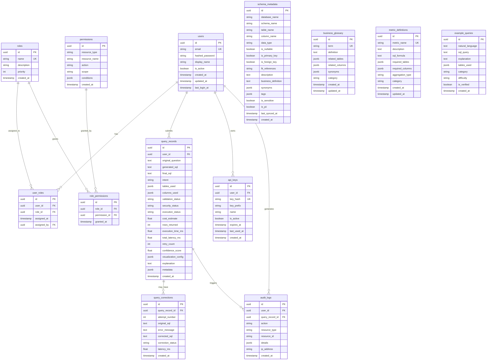
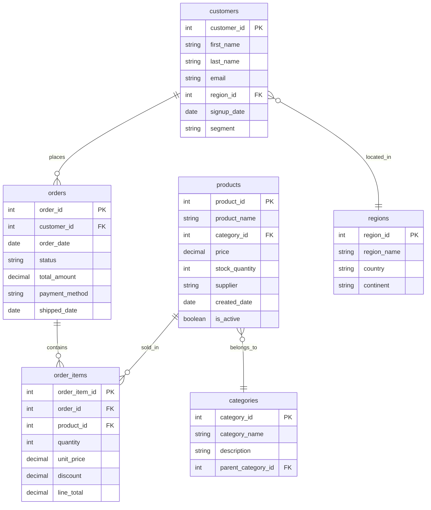

# Phase 4 — Database Design

This document covers two database domains:
1. **Application Database** — stores users, permissions, query history, audit logs, schema metadata
2. **Analytics Database** — the target database users query against (sample e-commerce domain)

---

## 4.1 ER Diagram — Application Database



---

## 4.2 Table Definitions — Application Database

### `users`
| Column | Type | Constraints | Description |
|--------|------|-------------|-------------|
| id | UUID | PK, DEFAULT gen_random_uuid() | Unique user identifier |
| email | VARCHAR(255) | UNIQUE, NOT NULL | User email (login) |
| hashed_password | VARCHAR(255) | NOT NULL | bcrypt hashed password |
| display_name | VARCHAR(100) | NOT NULL | Display name |
| is_active | BOOLEAN | DEFAULT true | Account active flag |
| created_at | TIMESTAMPTZ | DEFAULT now() | Account creation time |
| updated_at | TIMESTAMPTZ | DEFAULT now() | Last profile update |
| last_login_at | TIMESTAMPTZ | NULLABLE | Last successful login |

### `roles`
| Column | Type | Constraints | Description |
|--------|------|-------------|-------------|
| id | UUID | PK | Role identifier |
| name | VARCHAR(50) | UNIQUE, NOT NULL | Role name (admin, analyst, business_user, restricted) |
| description | TEXT | NULLABLE | Role description |
| priority | INTEGER | NOT NULL, DEFAULT 0 | Higher = more permissions (for conflict resolution) |
| created_at | TIMESTAMPTZ | DEFAULT now() | Creation time |

### `user_roles`
| Column | Type | Constraints | Description |
|--------|------|-------------|-------------|
| id | UUID | PK | Assignment identifier |
| user_id | UUID | FK → users(id), NOT NULL | Assigned user |
| role_id | UUID | FK → roles(id), NOT NULL | Assigned role |
| assigned_at | TIMESTAMPTZ | DEFAULT now() | When assigned |
| assigned_by | UUID | FK → users(id), NULLABLE | Who assigned it |

**Constraint**: UNIQUE(user_id, role_id)

### `permissions`
| Column | Type | Constraints | Description |
|--------|------|-------------|-------------|
| id | UUID | PK | Permission identifier |
| resource_type | VARCHAR(50) | NOT NULL | 'table', 'column', 'schema', 'operation' |
| resource_name | VARCHAR(255) | NOT NULL | e.g., 'orders', 'customers.email' |
| action | VARCHAR(50) | NOT NULL | 'read', 'list', 'query' |
| scope | VARCHAR(50) | DEFAULT 'full' | 'full', 'filtered', 'masked' |
| conditions | JSONB | NULLABLE | Row-level filter conditions |
| created_at | TIMESTAMPTZ | DEFAULT now() | Creation time |

**Constraint**: UNIQUE(resource_type, resource_name, action)

### `role_permissions`
| Column | Type | Constraints | Description |
|--------|------|-------------|-------------|
| id | UUID | PK | Assignment identifier |
| role_id | UUID | FK → roles(id), NOT NULL | Role |
| permission_id | UUID | FK → permissions(id), NOT NULL | Permission |
| granted_at | TIMESTAMPTZ | DEFAULT now() | When granted |

**Constraint**: UNIQUE(role_id, permission_id)

### `query_records`
| Column | Type | Constraints | Description |
|--------|------|-------------|-------------|
| id | UUID | PK | Query identifier |
| user_id | UUID | FK → users(id), NOT NULL | Submitting user |
| original_question | TEXT | NOT NULL | Natural language question |
| generated_sql | TEXT | NULLABLE | First generated SQL |
| final_sql | TEXT | NULLABLE | Final executed SQL (after corrections) |
| intent | VARCHAR(50) | NULLABLE | Detected intent category |
| tables_used | JSONB | DEFAULT '[]' | Tables referenced |
| columns_used | JSONB | DEFAULT '[]' | Columns referenced |
| validation_status | VARCHAR(20) | NOT NULL, DEFAULT 'pending' | pending/valid/invalid |
| security_status | VARCHAR(20) | NOT NULL, DEFAULT 'pending' | pending/allowed/denied |
| execution_status | VARCHAR(20) | NOT NULL, DEFAULT 'pending' | pending/running/success/failed/rejected |
| cost_estimate | FLOAT | NULLABLE | Estimated query cost |
| rows_returned | INTEGER | NULLABLE | Result row count |
| execution_time_ms | FLOAT | NULLABLE | DB execution time |
| total_latency_ms | FLOAT | NULLABLE | Total request latency |
| retry_count | INTEGER | DEFAULT 0 | Number of correction attempts |
| confidence_score | FLOAT | NULLABLE | LLM confidence (0-1) |
| visualization_config | JSONB | NULLABLE | Chart type + config |
| explanation | TEXT | NULLABLE | AI-generated explanation |
| metadata | JSONB | DEFAULT '{}' | Extra metadata (tokens, costs, etc.) |
| created_at | TIMESTAMPTZ | DEFAULT now() | Query submission time |

### `query_corrections`
| Column | Type | Constraints | Description |
|--------|------|-------------|-------------|
| id | UUID | PK | Correction record ID |
| query_record_id | UUID | FK → query_records(id), NOT NULL | Parent query |
| attempt_number | INTEGER | NOT NULL | 1, 2, 3... |
| original_sql | TEXT | NOT NULL | SQL that failed |
| error_message | TEXT | NOT NULL | Error from validation/execution |
| corrected_sql | TEXT | NOT NULL | LLM-corrected SQL |
| correction_status | VARCHAR(20) | NOT NULL | success/failed |
| latency_ms | FLOAT | NULLABLE | Time taken for correction |
| created_at | TIMESTAMPTZ | DEFAULT now() | Correction time |

**Constraint**: UNIQUE(query_record_id, attempt_number)

### `api_keys`
| Column | Type | Constraints | Description |
|--------|------|-------------|-------------|
| id | UUID | PK | Key identifier |
| user_id | UUID | FK → users(id), NOT NULL | Owning user |
| key_hash | VARCHAR(255) | UNIQUE, NOT NULL | SHA-256 hash of key |
| key_prefix | VARCHAR(10) | NOT NULL | First 8 chars for identification |
| name | VARCHAR(100) | NOT NULL | User-assigned name |
| is_active | BOOLEAN | DEFAULT true | Active flag |
| expires_at | TIMESTAMPTZ | NULLABLE | Expiration (null = never) |
| last_used_at | TIMESTAMPTZ | NULLABLE | Last usage time |
| created_at | TIMESTAMPTZ | DEFAULT now() | Creation time |

### `audit_logs`
| Column | Type | Constraints | Description |
|--------|------|-------------|-------------|
| id | UUID | PK | Log entry ID |
| user_id | UUID | FK → users(id), NULLABLE | Acting user |
| query_record_id | UUID | FK → query_records(id), NULLABLE | Related query |
| action | VARCHAR(50) | NOT NULL | 'query_submitted', 'access_denied', 'query_executed', etc. |
| resource_type | VARCHAR(50) | NULLABLE | 'query', 'schema', 'user', etc. |
| resource_id | VARCHAR(255) | NULLABLE | Resource identifier |
| details | JSONB | DEFAULT '{}' | Additional context |
| ip_address | VARCHAR(45) | NULLABLE | Client IP |
| created_at | TIMESTAMPTZ | DEFAULT now() | Event time |

### `schema_metadata`
| Column | Type | Constraints | Description |
|--------|------|-------------|-------------|
| id | UUID | PK | Metadata record ID |
| database_name | VARCHAR(100) | NOT NULL | Database name |
| schema_name | VARCHAR(100) | NOT NULL, DEFAULT 'public' | Schema name |
| table_name | VARCHAR(100) | NOT NULL | Table name |
| column_name | VARCHAR(100) | NULLABLE | Column name (null for table-level entries) |
| data_type | VARCHAR(50) | NULLABLE | Column data type |
| is_nullable | BOOLEAN | DEFAULT true | Nullable flag |
| is_primary_key | BOOLEAN | DEFAULT false | PK flag |
| is_foreign_key | BOOLEAN | DEFAULT false | FK flag |
| fk_references | VARCHAR(255) | NULLABLE | 'schema.table.column' |
| description | TEXT | NULLABLE | Human-readable description |
| business_definition | TEXT | NULLABLE | Business context |
| synonyms | JSONB | DEFAULT '[]' | Alternative names |
| tags | JSONB | DEFAULT '[]' | Categorization tags |
| is_sensitive | BOOLEAN | DEFAULT false | Contains sensitive data |
| is_pii | BOOLEAN | DEFAULT false | Contains PII |
| last_synced_at | TIMESTAMPTZ | NULLABLE | Last metadata sync |
| created_at | TIMESTAMPTZ | DEFAULT now() | Creation time |

**Constraint**: UNIQUE(database_name, schema_name, table_name, column_name)

### `business_glossary`
| Column | Type | Constraints | Description |
|--------|------|-------------|-------------|
| id | UUID | PK | Entry ID |
| term | VARCHAR(200) | UNIQUE, NOT NULL | Business term |
| definition | TEXT | NOT NULL | Plain-language definition |
| related_tables | JSONB | DEFAULT '[]' | Tables this term maps to |
| related_columns | JSONB | DEFAULT '[]' | Columns this term maps to |
| synonyms | JSONB | DEFAULT '[]' | Alternative terms |
| category | VARCHAR(50) | NULLABLE | Grouping category |
| created_at | TIMESTAMPTZ | DEFAULT now() | Creation time |
| updated_at | TIMESTAMPTZ | DEFAULT now() | Last update |

### `metric_definitions`
| Column | Type | Constraints | Description |
|--------|------|-------------|-------------|
| id | UUID | PK | Metric ID |
| metric_name | VARCHAR(200) | UNIQUE, NOT NULL | Metric name |
| description | TEXT | NOT NULL | What this metric measures |
| sql_formula | TEXT | NOT NULL | SQL expression (e.g., `SUM(amount)`) |
| required_tables | JSONB | NOT NULL | Tables needed |
| required_columns | JSONB | NOT NULL | Columns needed |
| aggregation_type | VARCHAR(50) | NOT NULL | sum, avg, count, ratio, etc. |
| category | VARCHAR(50) | NULLABLE | Grouping |
| created_at | TIMESTAMPTZ | DEFAULT now() | Creation time |
| updated_at | TIMESTAMPTZ | DEFAULT now() | Last update |

### `example_queries`
| Column | Type | Constraints | Description |
|--------|------|-------------|-------------|
| id | UUID | PK | Example ID |
| natural_language | TEXT | NOT NULL | The English question |
| sql_query | TEXT | NOT NULL | Correct SQL answer |
| explanation | TEXT | NULLABLE | Why this SQL answers the question |
| tables_used | JSONB | DEFAULT '[]' | Tables referenced |
| category | VARCHAR(50) | NULLABLE | Category (sales, inventory, etc.) |
| difficulty | VARCHAR(20) | DEFAULT 'medium' | easy/medium/hard |
| is_verified | BOOLEAN | DEFAULT false | Human-verified flag |
| created_at | TIMESTAMPTZ | DEFAULT now() | Creation time |

---

## 4.3 Indexes — Application Database

```sql
-- Users
CREATE INDEX idx_users_email ON users(email);
CREATE INDEX idx_users_is_active ON users(is_active) WHERE is_active = true;

-- User Roles
CREATE INDEX idx_user_roles_user_id ON user_roles(user_id);
CREATE INDEX idx_user_roles_role_id ON user_roles(role_id);

-- Permissions
CREATE INDEX idx_permissions_resource ON permissions(resource_type, resource_name);

-- Role Permissions
CREATE INDEX idx_role_permissions_role_id ON role_permissions(role_id);

-- Query Records
CREATE INDEX idx_query_records_user_id ON query_records(user_id);
CREATE INDEX idx_query_records_created_at ON query_records(created_at DESC);
CREATE INDEX idx_query_records_status ON query_records(execution_status);
CREATE INDEX idx_query_records_user_created ON query_records(user_id, created_at DESC);

-- Query Corrections
CREATE INDEX idx_query_corrections_query_id ON query_corrections(query_record_id);

-- API Keys
CREATE INDEX idx_api_keys_user_id ON api_keys(user_id);
CREATE INDEX idx_api_keys_prefix ON api_keys(key_prefix);

-- Audit Logs
CREATE INDEX idx_audit_logs_user_id ON audit_logs(user_id);
CREATE INDEX idx_audit_logs_created_at ON audit_logs(created_at DESC);
CREATE INDEX idx_audit_logs_action ON audit_logs(action);
CREATE INDEX idx_audit_logs_query_id ON audit_logs(query_record_id);

-- Schema Metadata
CREATE INDEX idx_schema_metadata_table ON schema_metadata(database_name, schema_name, table_name);
CREATE INDEX idx_schema_metadata_sensitive ON schema_metadata(is_sensitive) WHERE is_sensitive = true;

-- Business Glossary
CREATE INDEX idx_business_glossary_category ON business_glossary(category);

-- Metric Definitions
CREATE INDEX idx_metric_definitions_category ON metric_definitions(category);

-- Example Queries
CREATE INDEX idx_example_queries_category ON example_queries(category);
CREATE INDEX idx_example_queries_verified ON example_queries(is_verified) WHERE is_verified = true;
```

---

## 4.4 ER Diagram — Analytics Database (Sample E-Commerce Domain)



### Analytics Table Definitions

| Table | Purpose | Row Estimate (seed) |
|-------|---------|-------------------|
| customers | Customer master data | ~1,000 |
| orders | Order transactions | ~10,000 |
| order_items | Order line items | ~30,000 |
| products | Product catalog | ~200 |
| categories | Product categories | ~20 |
| regions | Geographic regions | ~10 |

### Analytics Indexes

```sql
-- Customers
CREATE INDEX idx_customers_region ON customers(region_id);
CREATE INDEX idx_customers_segment ON customers(segment);
CREATE INDEX idx_customers_signup ON customers(signup_date);

-- Orders
CREATE INDEX idx_orders_customer ON orders(customer_id);
CREATE INDEX idx_orders_date ON orders(order_date DESC);
CREATE INDEX idx_orders_status ON orders(status);
CREATE INDEX idx_orders_customer_date ON orders(customer_id, order_date DESC);

-- Order Items
CREATE INDEX idx_order_items_order ON order_items(order_id);
CREATE INDEX idx_order_items_product ON order_items(product_id);

-- Products
CREATE INDEX idx_products_category ON products(category_id);
CREATE INDEX idx_products_active ON products(is_active) WHERE is_active = true;
```

---

## 4.5 Data Layers (dbt Transformation)

```text
Raw Layer (ingested CSVs)
    → Staging Layer (stg_*: cleaned, typed, deduplicated)
        → Intermediate Layer (int_*: joined, enriched)
            → Marts Layer (fct_*, dim_*: business-ready)
```

| Layer | Example Tables | Description |
|-------|---------------|-------------|
| Staging | stg_orders, stg_products, stg_customers | Source-aligned, cleaned |
| Intermediate | int_order_items_enriched | Joined order_items + products + orders |
| Marts (facts) | fct_revenue, fct_orders_daily | Aggregated business metrics |
| Marts (dimensions) | dim_products, dim_customers, dim_regions | Conformed dimensions |

---

## 4.6 Vector Store Schema (Conceptual)

The vector database stores document chunks for RAG retrieval:

```text
Collection: schema_embeddings
├── id: string (UUID)
├── vector: float[] (dimension depends on embedding model)
├── payload:
│   ├── source_type: "table" | "column" | "relationship" | "glossary" | "metric" | "example"
│   ├── content: string (the text that was embedded)
│   ├── table_name: string (nullable)
│   ├── column_name: string (nullable)
│   ├── database_name: string
│   ├── schema_name: string
│   └── metadata: object (additional context)
```

This schema allows filtered vector search (e.g., only search within "table" type documents, or filter by database_name).
