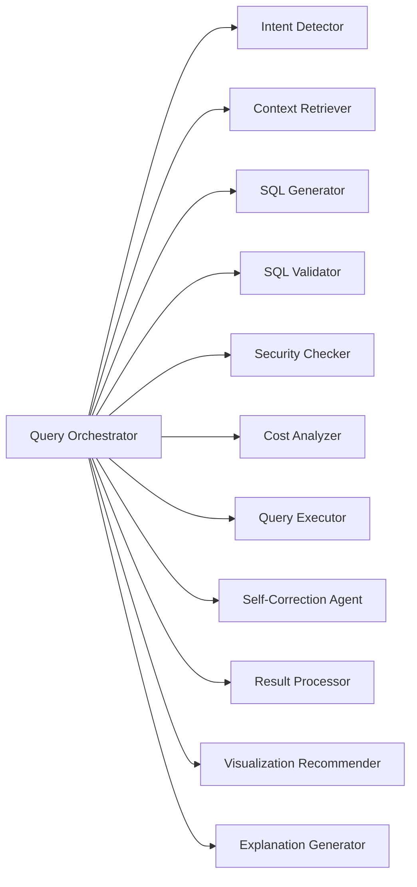
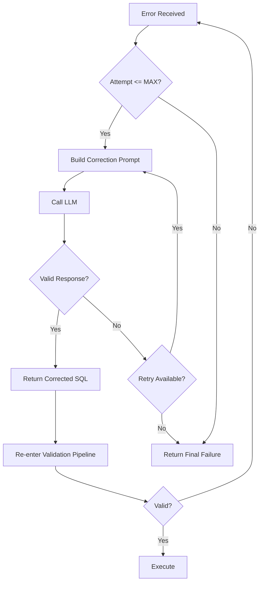

# Phase 6 — Agent Design

This document specifies every agent/node in the query orchestration pipeline — its inputs, processing logic, outputs, failure conditions, and retry behavior.

---

## 6.1 Agent Overview Map



---

## 6.2 Query Orchestrator (Coordinator)

**Role**: Central state machine that drives the pipeline. Not an "agent" itself — it's the coordinator that invokes agents in sequence.

### Input
```python
@dataclass
class OrchestratorInput:
    question: str                    # User's natural language question
    user_context: UserContext        # user_id, roles, permissions
    options: QueryOptions            # execute, explain, visualize, max_rows, timeout
    request_id: str                  # Trace correlation ID
```

### Processing
1. Initialize `QueryState = RECEIVED`
2. Transition through states in order, calling the appropriate agent at each step
3. Handle branching: validation failure → self-correction loop; security failure → reject
4. Collect metadata at each transition (latency, tokens, state)
5. Persist `query_record` at end (success or failure)

### Output
```python
@dataclass
class OrchestratorOutput:
    query_id: str
    final_state: QueryState         # COMPLETED | FAILED | REJECTED
    intent: IntentResult | None
    sql: SQLGenerationResult | None
    validation: ValidationResult | None
    security: SecurityResult | None
    cost: CostResult | None
    execution: ExecutionResult | None
    corrections: list[CorrectionRecord]
    visualization: VisualizationConfig | None
    explanation: str | None
    metadata: QueryMetadata
```

### Failure Conditions
| Condition | Behavior |
|-----------|----------|
| Any agent raises unrecoverable error | Transition to FAILED, log, return error |
| Security check denied | Transition to REJECTED, audit log |
| Max retries exceeded | Transition to FAILED with correction history |
| Timeout exceeded | Cancel current operation, return partial result or timeout error |

### Retry Behavior
The orchestrator itself doesn't retry — it delegates retry logic to the self-correction loop. The loop is bounded by `MAX_RETRIES` (default: 3).

---

## 6.3 Intent Detector

**Role**: Classify the user's question into an intent category and extract key entities.

### Input
```python
@dataclass
class IntentDetectorInput:
    question: str
    conversation_history: list[str] | None  # Optional context from prior questions
```

### Processing
1. Build prompt from `prompts/intent_detection.py` template
2. Call `LLMProvider.generate_structured()` with a schema expecting:
   - `category`: one of [aggregation, comparison, trend, detail, definition, count, ranking]
   - `entities`: extracted table/column/metric references
   - `time_range`: detected time filter (if any)
   - `filters`: detected filter conditions
   - `ambiguity_score`: 0-1 (how ambiguous is the question?)
3. If `ambiguity_score > 0.8`, add a note to context for the generator to include assumptions

### Output
```python
@dataclass
class IntentResult:
    category: str                    # aggregation, comparison, trend, etc.
    entities: list[str]             # ["products", "revenue", "orders"]
    time_range: TimeRange | None    # {period: "quarter", offset: -1}
    filters: list[FilterClause]    # [{column: "status", op: "=", value: "completed"}]
    ambiguity_score: float          # 0.0 - 1.0
    raw_llm_response: dict          # For debugging
```

### Failure Conditions
| Condition | Behavior |
|-----------|----------|
| LLM timeout (>10s) | Retry once with shorter prompt, then fail |
| LLM returns unparseable response | Retry once, then default to `category: "general"` |
| LLM provider unavailable | Fail fast — no fallback (intent is required) |

### Retry Behavior
- **Max retries**: 1 (within this agent, not orchestrator-level)
- **Retry strategy**: Simplify prompt (remove history, reduce examples)
- **Fallback**: If all retries fail, use basic keyword matching as degraded mode

---

## 6.4 Context Retriever (RAG Agent)

**Role**: Retrieve relevant schema, glossary, metrics, and examples via vector similarity + metadata filtering.

### Input
```python
@dataclass
class ContextRetrieverInput:
    question: str
    intent: IntentResult
    user_permissions: Permissions    # Filter out tables user can't access
```

### Processing
1. Generate embedding for `question` using `EmbeddingProvider.embed()`
2. Perform similarity search in vector store:
   - `top_k = 15` initial retrieval
   - Filter by `user_permissions.allowed_tables` (don't return forbidden schema)
3. Re-rank results by relevance + diversity:
   - Ensure at least one result per category (schema, glossary, example)
   - Deduplicate overlapping chunks
4. Trim to `top_k = 7` after re-ranking
5. For each retrieved table, also fetch:
   - All columns (from schema_metadata)
   - Foreign key relationships to other retrieved tables
6. Assemble final context package

### Output
```python
@dataclass
class RetrievedContext:
    tables: list[TableSchema]        # Relevant table definitions
    relationships: list[Relationship] # JOINs between retrieved tables
    glossary_terms: list[GlossaryTerm] # Relevant business definitions
    metrics: list[MetricDefinition]   # Relevant metric formulas
    example_queries: list[ExampleQuery] # Similar past queries (max 3)
    total_context_tokens: int         # Token budget accounting
```

### Failure Conditions
| Condition | Behavior |
|-----------|----------|
| Embedding provider timeout | Retry once (5s timeout) |
| Vector store unavailable | Fail — cannot generate SQL without context |
| No results above similarity threshold | Return empty context + flag for SQL generator |
| Token budget exceeded | Truncate least-relevant chunks |

### Retry Behavior
- **Max retries**: 1 for embedding, 1 for vector search
- **Timeout**: 5s per external call
- **Degradation**: If vector store is down, fall back to direct `schema_metadata` table lookup (keyword-based, not semantic)

---

## 6.5 SQL Generator

**Role**: Produce SQL from natural language + assembled context.

### Input
```python
@dataclass
class SQLGeneratorInput:
    question: str
    context: RetrievedContext
    intent: IntentResult
    user_permissions: Permissions     # Inform generator of allowed scope
    dialect: str                     # "postgresql", "mysql", etc.
    constraints: SQLConstraints      # max_rows, allowed_operations=["SELECT"]
```

### Processing
1. Build prompt from `prompts/sql_generation.py`:
   - System: You are a SQL expert. Generate ONLY SELECT queries.
   - Context: Tables, columns, relationships, glossary, examples
   - Rules: Target dialect, constraints, available tables only
   - Question: User's natural language
   - Output format: JSON with sql, tables_used, columns_used, assumptions, confidence
2. Call `LLMProvider.generate_structured()` with response schema
3. Parse and validate the LLM response structure
4. Extract SQL string and metadata

### Output
```python
@dataclass
class SQLGenerationResult:
    sql: str                         # Generated SQL statement
    tables_used: list[str]           # Tables referenced
    columns_used: list[str]          # Columns referenced
    assumptions: list[str]           # Assumptions made by LLM
    confidence: float                # 0.0 - 1.0
    tokens_used: int                 # Input + output tokens
    generation_time_ms: float        # LLM call duration
```

### Failure Conditions
| Condition | Behavior |
|-----------|----------|
| LLM returns empty/null SQL | Retry with simplified prompt |
| LLM returns non-SQL (explanation instead) | Re-prompt with stricter instruction |
| LLM timeout (>30s) | Retry once with shorter context |
| Response doesn't match expected schema | Attempt JSON repair, then retry |
| Confidence < 0.3 | Flag as low-confidence, proceed but warn user |

### Retry Behavior
- **Max retries**: 2 (within this agent)
- **Strategy**: 1st retry = simplify context (fewer examples). 2nd retry = minimal prompt.
- **Temperature**: Start at 0.1, increase to 0.3 on retry (more creativity)

---

## 6.6 SQL Validator

**Role**: Parse SQL AST and validate syntax, semantics, and safety.

### Input
```python
@dataclass
class SQLValidatorInput:
    sql: str
    dialect: str
    available_tables: list[str]      # Tables that actually exist
    available_columns: dict[str, list[str]]  # table → columns mapping
    blocked_operations: list[str]    # ["DROP", "DELETE", "UPDATE", "INSERT", ...]
```

### Processing
1. **Parse SQL into AST** using `<SQL_PARSER>` (sqlglot)
2. **Syntax check**: Does it parse without error?
3. **Operation check**: Is it SELECT-only? Block any write operations.
4. **Table check**: Do all referenced tables exist in `available_tables`?
5. **Column check**: Do all referenced columns exist in their respective tables?
6. **Subquery check**: Recursively validate subqueries
7. **Injection check**: Look for suspicious patterns (stacked queries, comments hiding code, UNION injection)
8. **Complexity check**: Count JOINs, subqueries, aggregations — flag if excessive
9. **Risk scoring**: LOW (simple select) / MEDIUM (joins, aggregations) / HIGH (subqueries, many tables) / CRITICAL (write ops detected)

### Output
```python
@dataclass
class ValidationResult:
    is_valid: bool
    errors: list[ValidationError]    # Blocking issues
    warnings: list[ValidationWarning] # Non-blocking concerns
    tables_used: list[str]
    columns_used: list[str]
    operations_detected: list[str]   # ["SELECT", "JOIN", "GROUP BY"]
    risk_level: str                  # LOW | MEDIUM | HIGH | CRITICAL
    complexity_score: int            # 0-100
```

### Failure Conditions
| Condition | Behavior |
|-----------|----------|
| SQL cannot be parsed | Return `is_valid=False` with syntax error |
| Write operation detected | Return `is_valid=False`, risk=CRITICAL |
| Unknown table referenced | Return `is_valid=False` with specific error |
| Unknown column referenced | Return `is_valid=False` with suggestion |

### Retry Behavior
- **No retries** — validation is deterministic. If SQL is invalid, it goes to self-correction.
- This agent never calls an LLM; it's pure logic.

---

## 6.7 Security Checker (RBAC)

**Role**: Enforce table/column/row-level access based on user's roles and permissions.

### Input
```python
@dataclass
class SecurityCheckerInput:
    sql: str                         # Parsed SQL
    tables_used: list[str]           # From validator
    columns_used: list[str]          # From validator
    user_permissions: Permissions     # User's resolved permissions
```

### Processing
1. For each table in `tables_used`:
   - Check if user has `read` permission on this table
   - If table is not in allowed list → deny
2. For each column in `columns_used`:
   - Check if column is marked as restricted for this role
   - If column is PII and user role doesn't have PII access → deny
3. Check row-level filters:
   - If user has `conditions` on a table (e.g., `region = 'US'`), verify the SQL includes this filter
   - If not, inject the filter or deny
4. Generate security report

### Output
```python
@dataclass
class SecurityResult:
    allowed: bool
    violations: list[SecurityViolation]  # [{table, column, reason}]
    row_filters_applied: list[str]       # Any injected WHERE clauses
    audit_entry: AuditEntry             # For logging
```

### Failure Conditions
| Condition | Behavior |
|-----------|----------|
| Permission data unavailable | Fail closed (deny) — never allow without verification |
| Unknown table in SQL | Deny (defense in depth — validator should catch this first) |
| Row filter injection fails | Deny the query |

### Retry Behavior
- **No retries** — security is deterministic and must not be degraded.
- Denials are final for that SQL. Self-correction can try a different query.

---

## 6.8 Cost Analyzer

**Role**: Estimate query cost/performance before execution.

### Input
```python
@dataclass
class CostAnalyzerInput:
    sql: str
    dialect: str
    limits: CostLimits               # max_cost, max_execution_time, max_rows
```

### Processing
1. Execute `EXPLAIN (FORMAT JSON)` on the SQL against the analytics DB
2. Parse the query plan:
   - Extract `total_cost` (planner estimate)
   - Extract `estimated_rows`
   - Detect sequential scans on large tables
3. Compare against configured limits:
   - `estimated_rows > max_rows` → warning
   - `total_cost > max_cost` → reject or warn
   - Sequential scan on table > 1M rows → warning
4. Determine verdict: SAFE / WARNING / REJECT

### Output
```python
@dataclass
class CostResult:
    estimated_cost: float            # Planner cost units
    estimated_rows: int              # Expected row count
    estimated_time_ms: float | None  # If available
    within_limits: bool
    verdict: str                     # "safe" | "warning" | "reject"
    warnings: list[str]             # Performance concerns
    query_plan_summary: str          # Human-readable plan summary
```

### Failure Conditions
| Condition | Behavior |
|-----------|----------|
| EXPLAIN fails (syntax error not caught by validator) | Treat as validation failure → self-correction |
| Database connection timeout | Retry once, then fail |
| EXPLAIN returns null plan | Proceed with WARNING (cannot estimate) |

### Retry Behavior
- **Max retries**: 1 (for connection issues only)
- If EXPLAIN itself fails due to SQL error, route to self-correction (not retry)

---

## 6.9 Query Executor

**Role**: Execute validated, authorized SQL against the analytics database with safety controls.

### Input
```python
@dataclass
class QueryExecutorInput:
    sql: str
    timeout_seconds: float           # Max execution time (default: 30)
    max_rows: int                    # Max rows to return (default: 1000)
    read_only: bool                  # Always True — enforced at connection level
```

### Processing
1. Acquire a READ-ONLY database connection from the pool
2. Set statement timeout: `SET LOCAL statement_timeout = '{timeout_seconds}s'`
3. Execute the SQL within a read-only transaction
4. Fetch results up to `max_rows + 1` (extra row to detect truncation)
5. If `max_rows + 1` rows returned, flag `truncated = True` and return only `max_rows`
6. Capture execution time, row count
7. Release connection back to pool

### Output
```python
@dataclass
class ExecutionResult:
    status: str                      # "success" | "error" | "timeout"
    columns: list[ColumnInfo]        # [{name, type}]
    rows: list[list[Any]]           # Result data
    row_count: int
    truncated: bool                  # True if results exceeded max_rows
    execution_time_ms: float
    error_message: str | None        # If status == "error"
```

### Failure Conditions
| Condition | Behavior |
|-----------|----------|
| Statement timeout | Return status="timeout", route to self-correction with hint: "simplify query" |
| SQL runtime error (e.g., division by zero) | Return status="error" with message, route to self-correction |
| Connection pool exhausted | Wait up to 5s, then return 503 |
| Database unreachable | Fail immediately |

### Retry Behavior
- **No retries at executor level** — execution errors go to self-correction agent
- Connection issues: 1 retry with exponential backoff (1s)

### Safety Guarantees
- Connection is ALWAYS read-only (set at session level)
- Statement timeout is ALWAYS set (defense against runaway queries)
- Results are ALWAYS bounded by max_rows
- SQL is NEVER modified by the executor (it executes exactly what it receives)

---

## 6.10 Self-Correction Agent

**Role**: Receive a failed SQL + error context and produce corrected SQL.

### Input
```python
@dataclass
class SelfCorrectionInput:
    original_question: str
    failed_sql: str
    error: str                       # Validation error, execution error, or security violation
    error_source: str                # "validation" | "security" | "execution" | "cost"
    context: RetrievedContext        # Original schema context
    attempt_number: int              # Current retry (1-based)
    previous_corrections: list[CorrectionRecord]  # History of prior attempts
```

### Processing
1. Build correction prompt from `prompts/sql_correction.py`:
   - Include: original question, failed SQL, specific error, schema context
   - Include: what NOT to do (based on error type)
   - Include: previous failed attempts (so it doesn't repeat mistakes)
2. If error_source == "security":
   - Include which tables/columns are forbidden
   - Ask to rewrite using only allowed resources
3. If error_source == "cost":
   - Ask to add LIMIT, simplify JOINs, add WHERE filters
4. If error_source == "execution":
   - Include the database error message verbatim
   - Ask to fix the specific issue
5. Call `LLMProvider.generate_structured()`
6. Return corrected SQL for re-validation

### Output
```python
@dataclass
class CorrectionResult:
    corrected_sql: str
    explanation: str                  # What was changed and why
    confidence: float                # LLM confidence in correction
    tokens_used: int
    correction_time_ms: float
```

### Failure Conditions
| Condition | Behavior |
|-----------|----------|
| LLM returns same SQL as input | Count as failed attempt, try with stronger instruction |
| LLM timeout | Retry once |
| LLM returns unparseable response | Retry once with simplified prompt |
| Attempt number > MAX_RETRIES | Stop — return final failure to orchestrator |

### Retry Behavior
- **Max retries**: 3 total correction attempts (controlled by orchestrator)
- **Strategy per attempt**:
  - Attempt 1: Full context + error message
  - Attempt 2: Simplified context + error + previous attempt history
  - Attempt 3: Minimal context + explicit "do NOT use [table/column]" instructions
- **Circuit breaker**: If the same error repeats 2x, stop retrying (the error is likely unfixable by the LLM)

### Correction Flow Diagram



---

## 6.11 Result Processor

**Role**: Transform raw database results into a clean, structured format.

### Input
```python
@dataclass
class ResultProcessorInput:
    execution_result: ExecutionResult
    original_question: str
    intent: IntentResult
```

### Processing
1. **Type coercion**: Convert DB types to JSON-safe types
   - Decimal → float
   - datetime → ISO-8601 string
   - None → null
   - bytes → base64 (if ever applicable)
2. **NULL handling**: Replace NULL with explicit null (don't drop rows)
3. **Column metadata**: Attach inferred types (numeric, categorical, temporal, text)
4. **Summary statistics**: For numeric columns, calculate min/max/avg/sum
5. **Truncation notice**: If results were truncated, include total estimate

### Output
```python
@dataclass
class ProcessedResult:
    columns: list[ColumnMetadata]    # [{name, type, inferred_category}]
    rows: list[list[Any]]           # Cleaned data
    row_count: int
    truncated: bool
    summary: dict                   # {column_name: {min, max, avg, sum}} for numerics
```

### Failure Conditions
| Condition | Behavior |
|-----------|----------|
| Type coercion fails for a value | Use string representation, add warning |
| Empty result set | Return valid empty result (not an error) |

### Retry Behavior
- **No retries** — deterministic processing. Failures are bugs, not transient.

---

## 6.12 Visualization Recommender

**Role**: Determine the best chart type and configuration from the result shape and query intent.

### Input
```python
@dataclass
class VisualizationInput:
    processed_result: ProcessedResult
    intent: IntentResult
    question: str                    # Original question for context
```

### Processing — Rule-Based Engine (Primary)

```python
# Decision Rules:
rules = {
    # Pattern: (column_types, intent) → chart_type
    ("temporal + numeric", "trend"): "line",
    ("categorical + numeric", "comparison"): "bar",
    ("categorical + numeric", "ranking"): "horizontal_bar",
    ("numeric_only", "aggregation"): "kpi_card",
    ("categorical + numeric (% of total)", "*"): "pie",
    ("2+ numeric", "comparison"): "scatter",
    ("temporal + categorical + numeric", "trend"): "multi_line",
}
```

1. Analyze column types from `ProcessedResult.columns`
2. Match against rule table using intent + column type pattern
3. If rule matches → use deterministic recommendation
4. If no rule matches → fall back to LLM recommendation (call `prompts/visualization.py`)
5. Build chart configuration (axes, title, colors, sort order)

### Output
```python
@dataclass
class VisualizationConfig:
    chart_type: str                  # "bar", "line", "pie", "kpi_card", "table", etc.
    config: dict                     # {x_axis, y_axis, title, sort, colors, ...}
    reasoning: str                   # Why this chart type was chosen
    fallback_type: str               # If frontend can't render primary, use this
```

### Failure Conditions
| Condition | Behavior |
|-----------|----------|
| No matching rule + LLM fallback fails | Default to "table" (always works) |
| Single row result | Use "kpi_card" |
| >50 categories on x-axis | Switch to "horizontal_bar" or "table" |

### Retry Behavior
- **LLM fallback**: 1 retry if LLM is used
- **Ultimate fallback**: Always default to `chart_type: "table"` — guaranteed to render

---

## 6.13 Explanation Generator

**Role**: Produce a natural-language summary of the query results.

### Input
```python
@dataclass
class ExplanationInput:
    question: str
    sql: str
    processed_result: ProcessedResult
    visualization: VisualizationConfig
```

### Processing
1. Build prompt from `prompts/explanation.py`:
   - Include: original question, column names, first N rows (max 20), summary stats
   - Instruction: Summarize in 2-3 sentences. Reference specific numbers from the data.
   - Constraint: Do NOT invent facts. Only reference values present in the data.
   - Constraint: Do NOT repeat the SQL. Explain what the RESULTS show.
2. Call `LLMProvider.generate()`
3. Validate explanation:
   - Check that any numbers mentioned exist in the result set
   - If hallucinated numbers detected, regenerate with stricter prompt

### Output
```python
@dataclass
class ExplanationResult:
    explanation: str                  # 2-3 sentence natural language summary
    key_insights: list[str]          # Bullet point insights
    tokens_used: int
```

### Failure Conditions
| Condition | Behavior |
|-----------|----------|
| LLM timeout | Return `explanation: null` — explanation is optional |
| LLM hallucinates numbers | Retry once with stricter prompt |
| Empty result set | Generate: "The query returned no results matching your criteria." |

### Retry Behavior
- **Max retries**: 1
- **Graceful degradation**: If explanation fails, the query still succeeds — explanation is optional enrichment

---

## 6.14 Agent Configuration Summary

| Agent | Uses LLM | Timeout | Max Retries | Can Fail Gracefully |
|-------|:--------:|---------|:-----------:|:-------------------:|
| Intent Detector | ✓ | 10s | 1 | Partial (keyword fallback) |
| Context Retriever | Embedding only | 5s per call | 1 | Partial (keyword fallback) |
| SQL Generator | ✓ | 30s | 2 | No (required) |
| SQL Validator | ✗ | <100ms | 0 | No (required) |
| Security Checker | ✗ | <100ms | 0 | No (required) |
| Cost Analyzer | ✗ | 5s | 1 | Yes (proceed with warning) |
| Query Executor | ✗ | 30s (configurable) | 0 (connection: 1) | No (required for results) |
| Self-Correction | ✓ | 30s | Orchestrator controls (3) | Yes (final failure) |
| Result Processor | ✗ | <100ms | 0 | No (required) |
| Visualization | ✓ (fallback only) | 10s | 1 | Yes (default: table) |
| Explanation | ✓ | 15s | 1 | Yes (optional) |

---

## 6.15 State Transition Table

| Current State | Event | Next State | Agent Called |
|--------------|-------|-----------|-------------|
| RECEIVED | auth_valid | INTENT_DETECTION | Intent Detector |
| RECEIVED | auth_invalid | REJECTED | — |
| INTENT_DETECTION | intent_detected | CONTEXT_RETRIEVAL | Context Retriever |
| INTENT_DETECTION | error | FAILED | — |
| CONTEXT_RETRIEVAL | context_ready | SQL_GENERATION | SQL Generator |
| CONTEXT_RETRIEVAL | error | FAILED | — |
| SQL_GENERATION | sql_generated | VALIDATION | SQL Validator |
| SQL_GENERATION | error (after retries) | FAILED | — |
| VALIDATION | valid | SECURITY_CHECK | Security Checker |
| VALIDATION | invalid | SELF_CORRECTION | Self-Correction |
| SECURITY_CHECK | allowed | COST_CHECK | Cost Analyzer |
| SECURITY_CHECK | denied | REJECTED | — |
| COST_CHECK | safe | EXECUTION | Query Executor |
| COST_CHECK | warning | EXECUTION (with flag) | Query Executor |
| COST_CHECK | reject | REJECTED | — |
| EXECUTION | success | RESULT_PROCESSING | Result Processor |
| EXECUTION | error | SELF_CORRECTION | Self-Correction |
| SELF_CORRECTION | corrected | VALIDATION | SQL Validator (loop) |
| SELF_CORRECTION | max_retries | FAILED | — |
| RESULT_PROCESSING | processed | POST_PROCESSING | Visualization + Explanation |
| POST_PROCESSING | complete | COMPLETED | — |
