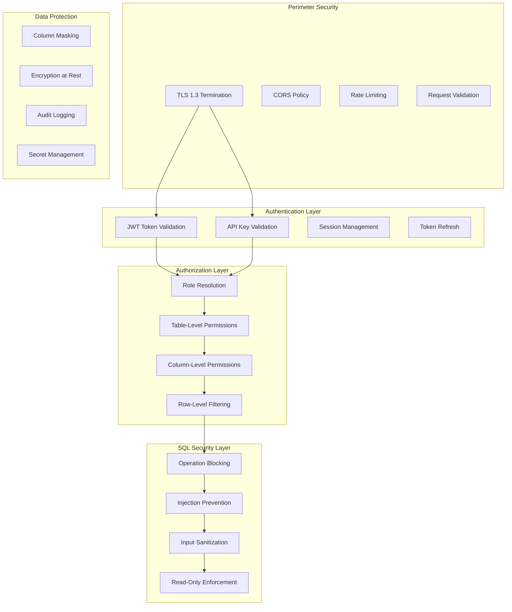
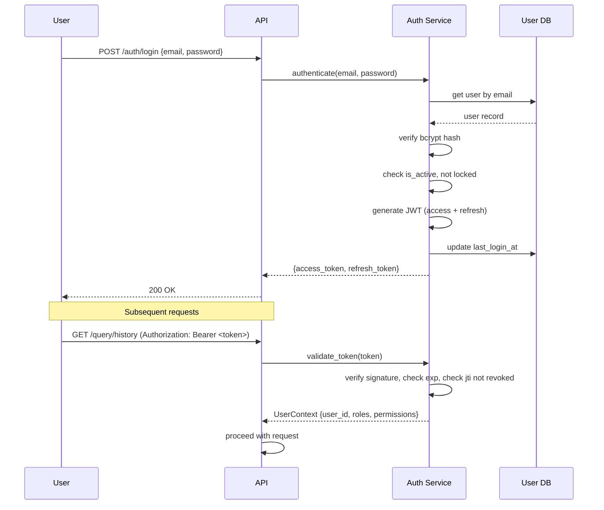
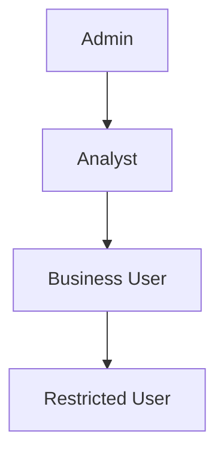
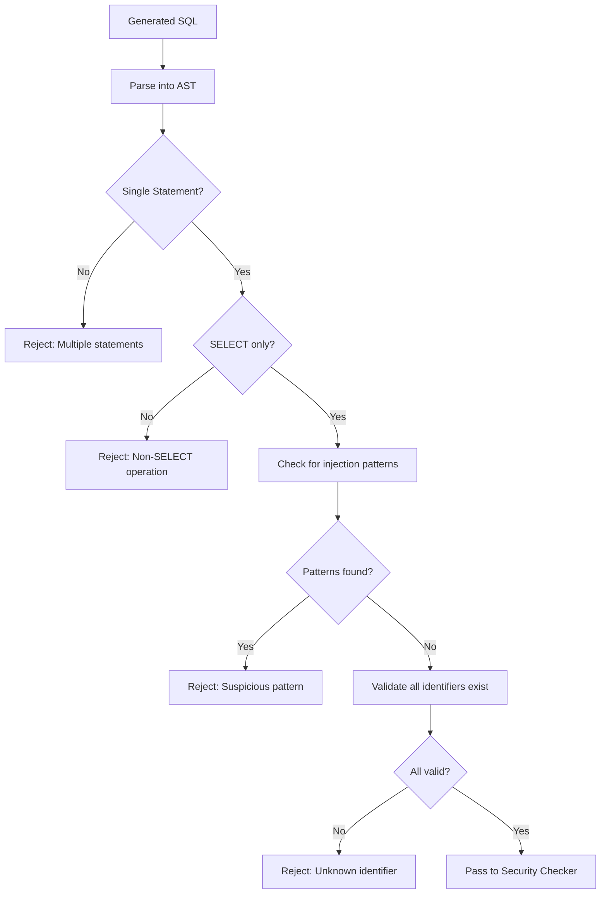

# Phase 7 — Security Design

## 7.1 Security Architecture Overview



---

## 7.2 Authentication

### 7.2.1 Authentication Methods

| Method | Use Case | Token Lifetime | Implementation |
|--------|----------|---------------|----------------|
| JWT Bearer Token | Web UI / Interactive sessions | Access: 1h, Refresh: 7d | Custom JWT via `<AUTH_PROVIDER>` |
| API Key | Programmatic access / integrations | Configurable (90d default) | Hashed key stored in DB |

### 7.2.2 JWT Token Structure

```json
{
  "header": {
    "alg": "HS256",
    "typ": "JWT"
  },
  "payload": {
    "sub": "user-uuid",
    "email": "user@company.com",
    "roles": ["analyst"],
    "permissions_hash": "sha256-of-permissions",
    "iat": 1722222000,
    "exp": 1722225600,
    "jti": "unique-token-id"
  }
}
```

### 7.2.3 Authentication Flow



### 7.2.4 Security Controls

| Control | Implementation |
|---------|---------------|
| Password hashing | bcrypt with cost factor 12 |
| Brute force protection | Lock account after 5 failed attempts (15 min cooldown) |
| Token revocation | Store revoked `jti` in Redis/memory cache until expiry |
| Refresh token rotation | Issue new refresh token on each refresh (one-time use) |
| API key hashing | SHA-256 hash stored; only prefix shown to user |
| Session binding | Optional: bind token to IP/user-agent fingerprint |

---

## 7.3 Authorization (RBAC)

### 7.3.1 Role Hierarchy



| Role | Description | Typical Access |
|------|-------------|---------------|
| **Admin** | System administrator | All tables, all columns, admin endpoints, user management |
| **Analyst** | Data analyst | All analytics tables, PII columns (masked), no admin endpoints |
| **Business User** | Business stakeholder | Aggregated data only, no raw PII, limited tables |
| **Restricted** | Limited access viewer | Specific whitelisted tables, no sensitive data |

### 7.3.2 Permission Model

Permissions are defined at three levels:

```python
@dataclass
class Permission:
    resource_type: str    # "table" | "column" | "operation"
    resource_name: str    # "orders" | "customers.email" | "query"
    action: str           # "read" | "list" | "masked_read"
    scope: str            # "full" | "filtered" | "masked"
    conditions: dict | None  # Row-level filter: {"region": "US"}
```

### 7.3.3 Permission Matrix Example

| Resource | Admin | Analyst | Business User | Restricted |
|----------|:-----:|:-------:|:-------------:|:----------:|
| orders (table) | ✓ full | ✓ full | ✓ full | ✓ filtered (own region) |
| customers (table) | ✓ full | ✓ full | ✓ aggregated only | ✗ |
| customers.email | ✓ full | ✓ masked | ✗ | ✗ |
| customers.phone | ✓ full | ✗ | ✗ | ✗ |
| products (table) | ✓ full | ✓ full | ✓ full | ✓ full |
| Admin endpoints | ✓ | ✗ | ✗ | ✗ |

### 7.3.4 Permission Enforcement Flow

```python
def check_permissions(sql: str, user_permissions: Permissions) -> SecurityResult:
    tables_in_sql = extract_tables(sql)
    columns_in_sql = extract_columns(sql)
    
    violations = []
    
    # 1. Table-level check
    for table in tables_in_sql:
        if table not in user_permissions.allowed_tables:
            violations.append(SecurityViolation(
                level="table",
                resource=table,
                reason=f"User does not have access to table '{table}'"
            ))
    
    # 2. Column-level check
    for column in columns_in_sql:
        table, col = column.split(".")
        col_permission = user_permissions.get_column_permission(table, col)
        if col_permission is None:
            violations.append(SecurityViolation(
                level="column",
                resource=column,
                reason=f"User does not have access to column '{column}'"
            ))
        elif col_permission.scope == "masked":
            # Allow but flag for masking in result processing
            pass
    
    # 3. Row-level filter injection
    row_filters = []
    for table in tables_in_sql:
        table_permission = user_permissions.get_table_permission(table)
        if table_permission and table_permission.conditions:
            row_filters.append(
                build_where_clause(table, table_permission.conditions)
            )
    
    return SecurityResult(
        allowed=len(violations) == 0,
        violations=violations,
        row_filters_applied=row_filters
    )
```

### 7.3.5 Column Masking

For columns with `scope: "masked"`:

```python
# Before returning results, mask sensitive columns
masking_rules = {
    "email": lambda v: v[:2] + "***@" + v.split("@")[1] if v else None,
    "phone": lambda v: "***-***-" + v[-4:] if v else None,
    "ssn": lambda v: "***-**-" + v[-4:] if v else None,
    "name": lambda v: v[0] + "***" if v else None,
}
```

---

## 7.4 SQL Injection Prevention

### 7.4.1 Multi-Layer Defense

| Layer | Defense | Implementation |
|-------|---------|---------------|
| 1. Input validation | Reject malicious patterns in natural language | Regex + heuristic checks |
| 2. Prompt engineering | Constrain LLM to produce only SELECT | System prompt restrictions |
| 3. SQL AST analysis | Parse SQL tree, validate structure | sqlglot parser |
| 4. Operation whitelist | Only allow SELECT operations | AST node type check |
| 5. Read-only connection | DB connection is physically read-only | DB user permissions |
| 6. Parameterization | Never interpolate user values into SQL | Prepared statements for any user-provided literals |

### 7.4.2 Injection Patterns Detected

```python
INJECTION_PATTERNS = [
    # Stacked queries
    r";\s*(DROP|DELETE|UPDATE|INSERT|ALTER|CREATE|TRUNCATE)",
    # Comment-based injection
    r"(--|/\*|\*/)",
    # UNION injection (unexpected UNION not from LLM context)
    r"UNION\s+(ALL\s+)?SELECT",
    # Tautology attacks
    r"(OR|AND)\s+['\"]?\d+['\"]?\s*=\s*['\"]?\d+['\"]?",
    # Encoded attacks
    r"(CHAR|CHR|CONCAT|0x)",
    # System function calls
    r"(pg_sleep|BENCHMARK|WAITFOR|xp_cmdshell|LOAD_FILE)",
    # Information schema probing
    r"information_schema\.",
]
```

### 7.4.3 SQL Sanitization Pipeline



---

## 7.5 Query Restrictions

### 7.5.1 Blocked Operations

```python
BLOCKED_OPERATIONS = {
    # DDL
    "CREATE", "ALTER", "DROP", "TRUNCATE", "RENAME",
    # DML (writes)
    "INSERT", "UPDATE", "DELETE", "MERGE", "UPSERT",
    # DCL
    "GRANT", "REVOKE",
    # TCL
    "COMMIT", "ROLLBACK", "SAVEPOINT",
    # Administrative
    "EXPLAIN ANALYZE",  # Can be expensive itself
    "VACUUM", "ANALYZE", "REINDEX",
    # Dangerous functions
    "pg_terminate_backend", "pg_cancel_backend",
    "set_config", "current_setting",
}
```

### 7.5.2 Read-Only Database User

The analytics database connection uses a dedicated read-only user:

```sql
-- Create read-only role for the application
CREATE ROLE app_readonly_user LOGIN PASSWORD '<FROM_SECRET_MANAGER>';
GRANT CONNECT ON DATABASE analytics TO app_readonly_user;
GRANT USAGE ON SCHEMA public TO app_readonly_user;
GRANT SELECT ON ALL TABLES IN SCHEMA public TO app_readonly_user;
ALTER DEFAULT PRIVILEGES IN SCHEMA public GRANT SELECT ON TABLES TO app_readonly_user;

-- Explicitly deny write operations
REVOKE INSERT, UPDATE, DELETE ON ALL TABLES IN SCHEMA public FROM app_readonly_user;

-- Set statement timeout at role level
ALTER ROLE app_readonly_user SET statement_timeout = '30s';

-- Set read-only transaction mode
ALTER ROLE app_readonly_user SET default_transaction_read_only = ON;
```

### 7.5.3 Resource Limits

| Limit | Default | Configurable | Purpose |
|-------|---------|:------------:|---------|
| Statement timeout | 30s | ✓ | Prevent runaway queries |
| Max rows returned | 1000 | ✓ | Prevent data exfiltration |
| Max result size | 10MB | ✓ | Prevent memory exhaustion |
| Max JOINs | 5 | ✓ | Prevent cartesian products |
| Max subquery depth | 3 | ✓ | Prevent complex attack patterns |
| Rate limit (queries/hour) | Role-based | ✓ | Prevent abuse |

---

## 7.6 Secret Management

### 7.6.1 Secret Categories

| Category | Examples | Storage |
|----------|----------|---------|
| Application secrets | JWT signing key, internal API keys | `<SECRET_MANAGER>` |
| Database credentials | Connection strings, passwords | `<SECRET_MANAGER>` |
| External API keys | LLM API key, embedding API key | `<SECRET_MANAGER>` |
| User passwords | Login credentials | bcrypt hashed in DB |
| API keys (user) | User-generated API keys | SHA-256 hashed in DB |

### 7.6.2 Secret Handling Rules

1. **Never** store secrets in code, git, or logs
2. **Never** return secret values in API responses
3. **Always** use environment variables or secret manager for injection
4. **Always** hash user-facing secrets (API keys, passwords) — store hash, not value
5. **Always** rotate secrets on a schedule (configurable)
6. **Always** use separate credentials per environment (dev/staging/prod)

### 7.6.3 `.env.example` (No Real Values)

```env
# Authentication
JWT_SECRET_KEY=<GENERATE_RANDOM_256_BIT_KEY>
JWT_ALGORITHM=HS256
ACCESS_TOKEN_EXPIRE_MINUTES=60
REFRESH_TOKEN_EXPIRE_DAYS=7

# Database
APP_DATABASE_URL=<PRIMARY_DATABASE_URL>
ANALYTICS_DATABASE_URL=<ANALYTICS_DATABASE_URL>

# LLM Provider
LLM_PROVIDER=<LLM_PROVIDER>
LLM_API_KEY=<LLM_API_KEY>
LLM_MODEL=<LLM_MODEL>

# Embedding
EMBEDDING_PROVIDER=<EMBEDDING_PROVIDER>
EMBEDDING_API_KEY=<EMBEDDING_API_KEY>

# Vector Store
VECTOR_DATABASE_URL=<VECTOR_DATABASE_URL>

# Observability
OTEL_EXPORTER_ENDPOINT=<OBSERVABILITY_ENDPOINT>

# Rate Limiting
RATE_LIMIT_REDIS_URL=<REDIS_URL>
```

---

## 7.7 Audit & Compliance

### 7.7.1 Audited Events

| Event | Logged Data | Severity |
|-------|-------------|----------|
| Login success | user_id, ip, timestamp | INFO |
| Login failure | email_attempted, ip, timestamp | WARN |
| Query submitted | user_id, question, query_id | INFO |
| Query executed | user_id, SQL, tables, execution_time | INFO |
| Access denied | user_id, resource, reason | WARN |
| Permission violation | user_id, table/column attempted | ALERT |
| SQL injection detected | user_id, pattern, raw_input | ALERT |
| API key created/revoked | user_id, key_prefix | INFO |
| Role changed | user_id, old_role, new_role, changed_by | WARN |
| Rate limit exceeded | user_id, endpoint, count | WARN |

### 7.7.2 Audit Log Structure

```python
@dataclass
class AuditEntry:
    timestamp: datetime
    event_type: str
    severity: str          # INFO | WARN | ALERT
    user_id: str | None
    ip_address: str | None
    request_id: str
    resource_type: str
    resource_id: str | None
    action: str
    outcome: str           # success | denied | error
    details: dict          # Additional context
```

### 7.7.3 Retention Policy

| Data | Retention | Reason |
|------|-----------|--------|
| Audit logs | 90 days (hot) + 1 year (cold storage) | Compliance, investigation |
| Query records | 30 days (hot) + 6 months (cold) | Analytics, debugging |
| Access tokens | Until expiry (memory/cache) | Session management |
| Failed login attempts | 24 hours | Brute force detection |

---

## 7.8 Security Threat Model

| Threat | Mitigation |
|--------|-----------|
| SQL injection via natural language | AST parsing + operation whitelist + read-only DB user |
| Prompt injection (manipulate LLM) | Output validation + SQL parsing (don't trust LLM output blindly) |
| Data exfiltration via broad queries | Max rows limit + RBAC + cost analyzer |
| Token theft | Short expiry + HTTPS only + optional IP binding |
| Privilege escalation | Permission checks on every request + no client-side role storage |
| Brute force | Account lockout + rate limiting |
| API key leak | Hashed storage + prefix-only display + expiration |
| Insider threat (over-permissioned) | Least privilege roles + audit logging |
| DoS via expensive queries | Statement timeout + rate limiting + cost analyzer |
| Cross-tenant data access | Row-level filtering + tenant isolation in DB |

---

## 7.9 Security Checklist (Pre-Deployment)

- [ ] All endpoints require authentication (except /health)
- [ ] JWT secret is randomly generated (≥256 bits)
- [ ] Passwords hashed with bcrypt (cost ≥12)
- [ ] API keys hashed with SHA-256
- [ ] Database user is read-only
- [ ] Statement timeout configured at DB level
- [ ] Rate limiting active on all endpoints
- [ ] CORS configured to allow only known origins
- [ ] TLS enabled (no plain HTTP)
- [ ] All secrets from environment variables or secret manager
- [ ] No secrets in logs, responses, or error messages
- [ ] Audit logging for all security-relevant events
- [ ] SQL injection patterns tested and blocked
- [ ] RBAC permissions verified with integration tests
- [ ] Blocked operations list tested (DROP/DELETE/etc.)
- [ ] Max rows and timeout limits enforced
