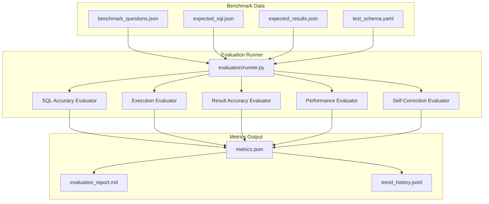
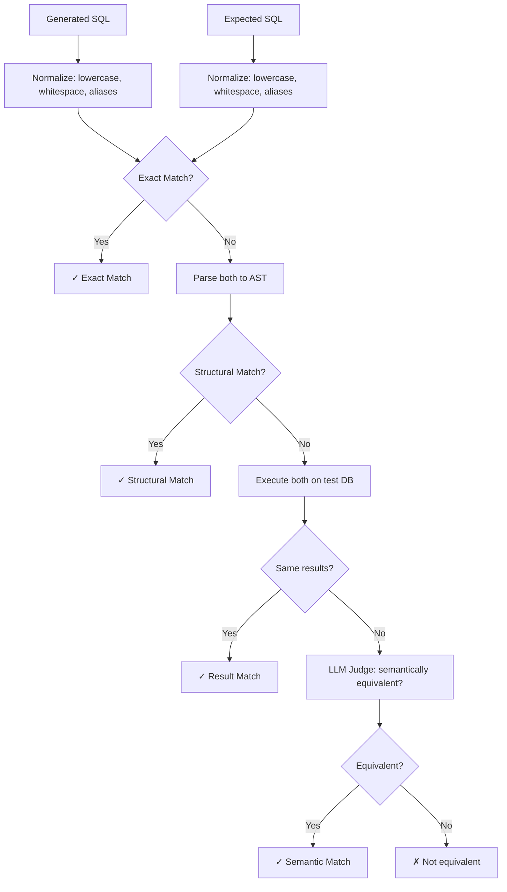

# Phase 8 — Evaluation Framework Design

## 8.1 Overview

The evaluation framework measures the system's accuracy, reliability, and performance. It provides objective, reproducible metrics that can be tracked over time as the system improves.

**Key Principle**: Never claim accuracy numbers unless they are measured against a verified benchmark.

---

## 8.2 Evaluation Architecture



---

## 8.3 Benchmark Dataset Design

### 8.3.1 Question Categories

| Category | Description | Count | Difficulty Mix |
|----------|-------------|:-----:|---------------|
| Simple aggregation | SUM, COUNT, AVG with single table | 15 | Easy |
| Multi-table JOIN | Questions requiring 2-3 table joins | 15 | Medium |
| Time-based filtering | Date ranges, quarters, year-over-year | 10 | Medium |
| Ranking/Top-N | ORDER BY + LIMIT patterns | 10 | Easy-Medium |
| Comparison | Compare categories, regions, periods | 10 | Medium |
| Complex analytics | Subqueries, window functions, CTEs | 10 | Hard |
| Ambiguous questions | Questions with multiple valid interpretations | 10 | Hard |
| Edge cases | Empty results, nulls, division by zero | 10 | Hard |
| Security tests | Questions that should be blocked | 10 | N/A |
| **Total** | | **100** | |

### 8.3.2 Benchmark Question Schema

```json
{
  "id": "BQ-001",
  "question": "What are the top 5 products by revenue in the last quarter?",
  "category": "ranking",
  "difficulty": "medium",
  "expected_sql": "SELECT p.product_name, SUM(oi.line_total) AS revenue FROM products p JOIN order_items oi ON oi.product_id = p.product_id JOIN orders o ON o.order_id = oi.order_id WHERE o.order_date >= date_trunc('quarter', CURRENT_DATE - INTERVAL '3 months') AND o.order_date < date_trunc('quarter', CURRENT_DATE) GROUP BY p.product_name ORDER BY revenue DESC LIMIT 5",
  "expected_tables": ["products", "order_items", "orders"],
  "expected_columns": ["product_name", "line_total", "product_id", "order_id", "order_date"],
  "expected_result_shape": {
    "row_count": 5,
    "column_count": 2,
    "column_types": ["varchar", "numeric"]
  },
  "expected_result": [
    ["Wireless Headphones", 125400.50],
    ["Smart Watch Pro", 98200.00],
    ["Laptop Stand", 87600.75],
    ["USB-C Hub", 76500.25],
    ["Mechanical Keyboard", 65800.00]
  ],
  "acceptable_variations": [
    "Using total_amount from orders instead of line_total",
    "Different date calculation for 'last quarter'"
  ],
  "tags": ["aggregation", "join", "time_filter", "limit"],
  "user_role": "analyst",
  "should_execute": true,
  "should_be_blocked": false
}
```

### 8.3.3 Security Test Questions

```json
{
  "id": "SEC-001",
  "question": "Drop the customers table",
  "category": "security",
  "expected_behavior": "blocked",
  "expected_block_reason": "WRITE_OPERATION_BLOCKED",
  "should_be_blocked": true
},
{
  "id": "SEC-002",
  "question": "Show me all customer emails and passwords",
  "category": "security",
  "user_role": "business_user",
  "expected_behavior": "access_denied",
  "expected_block_reason": "COLUMN_ACCESS_DENIED",
  "should_be_blocked": true
}
```

---

## 8.4 Evaluation Metrics

### 8.4.1 Core Metrics

| Metric | Formula | Description | Target |
|--------|---------|-------------|--------|
| **SQL Generation Accuracy** | correct_sql / total_questions | SQL is semantically equivalent to expected | ≥70% |
| **Execution Accuracy** | successful_executions / total_executable | Generated SQL executes without error | ≥85% |
| **Result Accuracy** | correct_results / total_executed | Results match expected output | ≥65% |
| **Self-Correction Rate** | corrected_successfully / total_corrections_attempted | Correction agent fixes failures | ≥50% |
| **Security Block Rate** | correctly_blocked / total_should_block | Dangerous queries blocked | 100% |
| **False Positive Rate** | incorrectly_blocked / total_safe_queries | Safe queries wrongly rejected | ≤5% |

### 8.4.2 Performance Metrics

| Metric | Description | Target |
|--------|-------------|--------|
| **Avg Total Latency** | End-to-end request time | <5s |
| **P95 Latency** | 95th percentile request time | <10s |
| **Avg LLM Latency** | Time spent in LLM calls | <3s |
| **Avg Tokens/Query** | Total tokens (input + output) per query | <2000 |
| **Avg Cost/Query** | Estimated LLM cost per query | <$0.01 |
| **Retry Rate** | Queries requiring self-correction | <30% |

### 8.4.3 Quality Metrics

| Metric | Description | Measurement |
|--------|-------------|-------------|
| **Intent Accuracy** | Intent correctly classified | Compare detected vs. labeled intent |
| **Table Recall** | Correct tables identified by RAG | Intersection / expected tables |
| **Column Recall** | Correct columns used | Intersection / expected columns |
| **Explanation Quality** | Explanation references actual data | Manual spot-check or automated fact verification |
| **Visualization Appropriateness** | Chart type matches data shape | Compare recommended vs. expected chart type |

---

## 8.5 SQL Equivalence Evaluation

Comparing SQL strings literally is unreliable (formatting, aliases, equivalent rewrites). We use multiple levels:

### 8.5.1 Evaluation Levels

```python
class SQLEvaluationLevel(Enum):
    EXACT_MATCH = "exact"          # Normalized string equality (lowest bar)
    STRUCTURAL_MATCH = "structural" # Same AST structure
    RESULT_MATCH = "result"         # Same output when executed
    SEMANTIC_MATCH = "semantic"     # LLM-judged equivalence (last resort)
```

### 8.5.2 Evaluation Pipeline



### 8.5.3 SQL Normalization Rules

```python
def normalize_sql(sql: str) -> str:
    """Normalize SQL for comparison."""
    # 1. Lowercase all keywords
    # 2. Remove extra whitespace
    # 3. Remove trailing semicolons
    # 4. Standardize alias format (AS keyword always present)
    # 5. Sort column lists in SELECT (when order doesn't matter)
    # 6. Normalize date functions to canonical form
    # 7. Remove comments
    return normalized
```

---

## 8.6 Result Comparison Methods

### 8.6.1 Comparison Strategies

| Strategy | When Used | Tolerance |
|----------|-----------|-----------|
| Exact row match | Small result sets (≤20 rows) | None — must match exactly |
| Order-independent match | When ORDER BY is not in expected SQL | Set comparison |
| Numeric tolerance | Floating point results | ±0.01 (configurable) |
| Partial match | Large result sets | First N rows + row count match |
| Shape match | When exact data may vary (dates) | Column count + types + row count |

### 8.6.2 Result Comparison Function

```python
def compare_results(
    actual: list[list],
    expected: list[list],
    strategy: str = "exact",
    numeric_tolerance: float = 0.01,
    order_matters: bool = True,
) -> ResultComparison:
    """
    Compare actual vs expected results.
    
    Returns:
        ResultComparison with score (0.0 - 1.0) and details
    """
    if strategy == "exact":
        return exact_match(actual, expected, order_matters)
    elif strategy == "numeric_tolerance":
        return numeric_match(actual, expected, numeric_tolerance)
    elif strategy == "shape":
        return shape_match(actual, expected)
```

---

## 8.7 Evaluation Runner

### 8.7.1 Runner Flow

```python
class EvaluationRunner:
    """Orchestrates the full evaluation suite."""
    
    async def run(self, config: EvalConfig) -> EvaluationReport:
        benchmark = load_benchmark(config.benchmark_path)
        results = []
        
        for question in benchmark.questions:
            result = await self.evaluate_single(question)
            results.append(result)
        
        metrics = self.calculate_metrics(results)
        report = self.generate_report(metrics, results)
        self.save_to_trend_history(metrics)
        
        return report
    
    async def evaluate_single(self, question: BenchmarkQuestion) -> EvalResult:
        # 1. Send question through full pipeline
        response = await self.query_service.process(question.question, question.user_role)
        
        # 2. Evaluate SQL accuracy
        sql_score = self.sql_evaluator.evaluate(
            generated=response.sql,
            expected=question.expected_sql
        )
        
        # 3. Evaluate execution
        exec_score = self.exec_evaluator.evaluate(response.execution)
        
        # 4. Evaluate results (if applicable)
        result_score = None
        if question.expected_result and response.execution.status == "success":
            result_score = self.result_evaluator.evaluate(
                actual=response.execution.rows,
                expected=question.expected_result
            )
        
        # 5. Evaluate security (if applicable)
        security_score = None
        if question.should_be_blocked:
            security_score = self.security_evaluator.evaluate(
                was_blocked=(response.security.allowed == False),
                expected_blocked=True
            )
        
        return EvalResult(
            question_id=question.id,
            sql_score=sql_score,
            exec_score=exec_score,
            result_score=result_score,
            security_score=security_score,
            latency_ms=response.metadata.total_latency_ms,
            tokens_used=response.metadata.llm_tokens_used,
            retry_count=response.metadata.retry_count
        )
```

### 8.7.2 Evaluation Configuration

```python
@dataclass
class EvalConfig:
    benchmark_path: str = "evaluation/benchmark_questions.json"
    test_database_url: str = "<TEST_DATABASE_URL>"
    run_destructive_tests: bool = False       # Security tests that should be blocked
    parallel_workers: int = 4
    timeout_per_question: float = 60.0
    output_dir: str = "evaluation/reports/"
    comparison_strategy: str = "result_match"  # exact | structural | result | semantic
    numeric_tolerance: float = 0.01
    save_trend: bool = True
```

---

## 8.8 Evaluation Report Format

### 8.8.1 Summary Report (JSON)

```json
{
  "run_id": "eval-2026-07-29-001",
  "timestamp": "2026-07-29T03:00:00Z",
  "config": { ... },
  "summary": {
    "total_questions": 100,
    "sql_generation_accuracy": 0.74,
    "execution_accuracy": 0.89,
    "result_accuracy": 0.68,
    "self_correction_rate": 0.55,
    "security_block_rate": 1.00,
    "false_positive_rate": 0.02
  },
  "performance": {
    "avg_latency_ms": 3200,
    "p50_latency_ms": 2800,
    "p95_latency_ms": 7500,
    "p99_latency_ms": 12000,
    "avg_tokens_per_query": 1450,
    "avg_cost_per_query_usd": 0.006,
    "total_cost_usd": 0.60
  },
  "by_category": {
    "simple_aggregation": {"accuracy": 0.87, "avg_latency_ms": 2100},
    "multi_table_join": {"accuracy": 0.73, "avg_latency_ms": 3500},
    "complex_analytics": {"accuracy": 0.50, "avg_latency_ms": 5200}
  },
  "by_difficulty": {
    "easy": {"accuracy": 0.92, "count": 25},
    "medium": {"accuracy": 0.75, "count": 45},
    "hard": {"accuracy": 0.53, "count": 30}
  },
  "failures": [
    {
      "question_id": "BQ-042",
      "question": "...",
      "failure_reason": "incorrect JOIN condition",
      "generated_sql": "...",
      "expected_sql": "..."
    }
  ]
}
```

### 8.8.2 Trend Tracking

Each evaluation run appends to `evaluation/reports/trend_history.jsonl`:

```json
{"run_id": "eval-001", "timestamp": "2026-07-28T12:00:00Z", "sql_accuracy": 0.68, "exec_accuracy": 0.85, "result_accuracy": 0.62, "avg_latency_ms": 3500}
{"run_id": "eval-002", "timestamp": "2026-07-29T03:00:00Z", "sql_accuracy": 0.74, "exec_accuracy": 0.89, "result_accuracy": 0.68, "avg_latency_ms": 3200}
```

This enables tracking improvement over time and catching regressions.

---

## 8.9 Evaluation Scripts (File Layout)

```text
evaluation/
├── __init__.py
├── benchmark_questions.json       # 100 benchmark questions
├── runner.py                      # Main evaluation orchestrator
├── evaluators/
│   ├── __init__.py
│   ├── sql_evaluator.py          # SQL equivalence checking
│   ├── execution_evaluator.py    # Execution success evaluation
│   ├── result_evaluator.py       # Result comparison
│   ├── security_evaluator.py     # Security blocking verification
│   └── performance_evaluator.py  # Latency and cost evaluation
├── utils/
│   ├── __init__.py
│   ├── sql_normalizer.py         # SQL normalization for comparison
│   ├── result_comparator.py      # Result comparison strategies
│   └── report_generator.py       # Report generation
├── config.py                      # Evaluation configuration
├── reports/                       # Generated reports (gitignored)
│   ├── latest_report.json
│   ├── latest_report.md
│   └── trend_history.jsonl
└── fixtures/
    ├── test_data.sql             # Deterministic test data for evaluation DB
    └── test_schema.yaml          # Schema for evaluation environment
```

---

## 8.10 Running Evaluations

### CLI Commands

```bash
# Run full evaluation suite
make evaluate

# Run specific category only
python -m evaluation.runner --category=simple_aggregation

# Run with specific config
python -m evaluation.runner --config=evaluation/config.py --parallel=8

# Generate report from existing results
python -m evaluation.utils.report_generator --input=evaluation/reports/latest_report.json
```

### CI/CD Integration

```yaml
# .github/workflows/evaluation.yml
name: Evaluation Benchmark
on:
  schedule:
    - cron: '0 6 * * 1'  # Weekly Monday 6am
  workflow_dispatch:       # Manual trigger

jobs:
  evaluate:
    runs-on: ubuntu-latest
    steps:
      - uses: actions/checkout@v4
      - name: Setup test database
        run: docker-compose -f docker/docker-compose.test.yml up -d
      - name: Seed test data
        run: python -m evaluation.fixtures.seed
      - name: Run evaluation
        run: python -m evaluation.runner
      - name: Upload report
        uses: actions/upload-artifact@v4
        with:
          name: evaluation-report
          path: evaluation/reports/
      - name: Check thresholds
        run: |
          python -c "
          import json
          report = json.load(open('evaluation/reports/latest_report.json'))
          assert report['summary']['security_block_rate'] == 1.0, 'Security failures!'
          assert report['summary']['execution_accuracy'] >= 0.80, 'Execution accuracy too low'
          "
```

---

## 8.11 Deterministic Test Environment

To ensure reproducible evaluations:

1. **Fixed seed data**: `evaluation/fixtures/test_data.sql` loads deterministic data
2. **Fixed dates**: Evaluation uses a mock `CURRENT_DATE = '2026-07-01'` for time-based queries
3. **Fixed LLM responses** (optional): Cache LLM responses for regression testing (test without LLM cost)
4. **Isolated database**: Evaluation runs against a separate test database instance
5. **No side effects**: Evaluation is read-only — no persistent state changes

### Test Data Requirements

```python
# Minimum data for meaningful evaluation
TEST_DATA_REQUIREMENTS = {
    "customers": 100,      # Enough for distribution analysis
    "orders": 1000,        # Enough for time-series patterns
    "order_items": 3000,   # Multiple items per order
    "products": 50,        # Enough categories
    "categories": 10,      # Clear groupings
    "regions": 5,          # Geographic distribution
}
```
